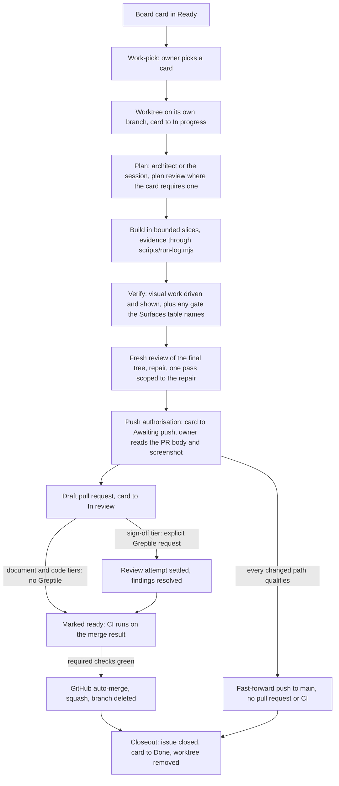

# The life of one change

One card becomes one commit on `main` by the same path every time: an owner pick, an isolated worktree, a plan, bounded
builds with recorded evidence, a fresh review and an owner yes, then a merge the platform performs or, for a change the
repository's own gate admits whole, a push straight to `main`. This page follows that path stage by stage. This page is
part of [the workflow guide](AI-WORKFLOW.md). Related: [The seats](AI-WORKFLOW-seats.md) for who acts at each stage,
[The board](AI-WORKFLOW-board.md) for the columns a card moves through, [The evidence bar](AI-WORKFLOW-evidence.md) for
what a build must prove, and [Enforced or instructed](AI-WORKFLOW-enforcement.md) for the guards named below.

## Mental model

| Stage | What happens | What a machine holds |
|---|---|---|
| Job starts | The card gets its own worktree and branch, the root checkout stays on `main`, and the card moves to In progress | Branch work in the root checkout is refused |
| Build | Bounded slices, every check logging its exit code, and an executed mutation where the testing strategy requires one, before review | An incomplete handoff is refused, and so is a turn that ends on a lint error |
| Review | One fresh review of the final tree, repairs, and a security review when the trust perimeter widens | Nothing: review is instructed |
| Deliver | A draft pull request, an external review where the tier requires it, and checks on the merge result; or, for a change the repository's own gate admits whole, a push straight to `main` | A pull request that is not a draft is refused, and so is an unsafe force push; [the head of `scripts/lib/unsafe-git.mjs`](../scripts/lib/unsafe-git.mjs) lists the exact forms |
| Merge | On the pull request route, the platform merges once the required checks are green, squashed, with the branch deleted | A merge command other than the platform's auto-merge is refused, and the branch rules require the checks |
| After merge | The issue is confirmed closed, the card moves to Done, servers and containers are stopped, and the worktree is removed and local `main` advances where that is provably safe | Nothing: closeout is instructed |

## How it works

The diagram shows the whole path from a card to a merged commit, including the branch where a qualifying change
goes straight to `main`.

In words: a card in Ready is picked by the owner, gets a worktree on its own branch and moves to In progress. It
is planned by an architect or by the session, with a plan review where the card requires one;
[the `resume` skill](../.agents/skills/resume/SKILL.md) owns that rule under "4. Plan". It is then built in
bounded slices with recorded evidence, verified, and given a fresh review of the final tree with repairs. At push
authorisation the card moves to Awaiting push and the owner reads the pull request body. On the owner's yes a
draft pull request opens and the card moves to In review; a change at the sign-off tier first settles an external
review, and every draft is then marked ready so the checks run on the merge result. Once the required checks are green
the platform merges, and closeout confirms the issue closed, moves the card to Done and removes the worktree. A change
whose every path qualifies skips the pull request, is pushed straight to `main`, and is closed out the same way.

### Stage by stage

- **Intake.** The hook check, the fetch and the local inventory are issued together; selecting current verifier
  code follows. The `resume` skill's instruction-reuse rule avoids rereading content whose Git identity and full
  active context are verified, and proves every path in one command. One board command then reads the board once
  and prints the pick listing, the drift scan and the full details of every card a session may offer or must
  show, its latest claim included, while the pull-request, sync and tooling reads overlap it; results and
  failures are collected before reconciliation. Its exit status separates a failed board read, drift and a card
  whose details could not be read, and such a card is never offered as startable. Pull-request summaries
  identify which continuation bodies matter, and the captured details serve selection and planning. Once every
  read has returned the session rechecks the verifier checkout: movement or conflicting facts invalidate
  affected evidence. These reduce hand-composed commands and serial waits while retaining freshness, complete
  recommendations, claims, triage authority and both owner gates; they establish no total agent-latency
  guarantee.
- **Isolation.** Every issue gets its own git worktree on its own branch, so two issues in two terminals never
  share a working file. A runtime's own subagent worktree is not that worktree: it branches from `main` rather
  than from the job branch, so builders never run in one. Two slices of one issue with disjoint files can run at
  once, the second in its own worktree cut from the job branch and merged back into it. A generated artifact the
  `generated artifacts` row of the Conventions table in `.agents/REPOSITORY.md` names is never hand-merged, and the hooks keep
  it from landing stale. When a session starts a card it posts a claim comment on the issue, because a job branch
  stays local until push and the comment is what another machine can see. Where the worktree lives on each
  runtime, the commands that create it, the slice branch name, the claim format and what happens to an In
  progress card with nothing behind it are in [the `resume` skill](../.agents/skills/resume/SKILL.md) under
  "1. Find where things stand" and "3. Start the job".
- **Evidence during the build.** Every executed check runs through a logger that writes its real outcome, so the
  pull request body quotes what a script wrote, not what an agent remembers;
  [The evidence bar](AI-WORKFLOW-evidence.md) explains the log. Every green slice is committed on the job branch,
  so a crash costs at most the slice in progress.
- **Verification before review.** Visual work is driven as the Conventions table's `visual verification` row says
  and a current screenshot is shown in chat; any further gate the Surfaces table names runs here.
- **Review in two layers.** One fresh review of the final tree comes before push authorisation, and its depth
  follows two questions asked of the change, whether it can be undone and how far the damage reaches if it is wrong,
  which each repository answers in its Surfaces table: the session itself, the model family that did not write the
  diff, because a writer's own family shares its blind spots, or that pass and an external review on the finished
  draft.
  [The `resume` skill](../.agents/skills/resume/SKILL.md) owns the two questions, the tiers they choose between,
  how each is run, what happens when a reviewer cannot be reached, and how repairs are reviewed again, under "5. Build",
  "6. Verify and review" and "8. Deliver"; [the `greptile` skill](../.agents/skills/greptile/SKILL.md) owns how the
  external review is requested and settled, and when an attempt counts as unavailable.
- **Delivery by GitHub.** On the pull request route, marking the pull request ready, after any required review
  attempt has settled, starts continuous integration, and the merge is always queued as a GitHub auto-merge, which
  GitHub completes only when the checks the repository's branch rules require are green; no agent merges a job's
  pull request directly. After the merge is queued the session waits on one command that only reads the pull
  request's state, and closeout follows a merge. A change `scripts/gates/pre-push-main` admits whole skips the
  pull request and is pushed straight to `main` on the same push authorisation.
  [The `resume` skill](../.agents/skills/resume/SKILL.md) owns the sequence, the waiting command and the direct
  route under "8. Deliver", and how a session waits on a long command under "5. Build";
  [Enforced or instructed](AI-WORKFLOW-enforcement.md) names the checks the branch rules require;
  [`AGENTS.md`](../AGENTS.md) owns what the direct route admits under "Publication and machinery"; the documentation
  routines' own merge exception is in [`docs/DOC-SWEEP.md`](DOC-SWEEP.md) and
  [`docs/SWEEP-TRIAGE.md`](SWEEP-TRIAGE.md).
- **Closeout.** The moment the merge lands, the same session confirms it, moves the card, updates local `main`, and
  removes the branch and worktree. Local `main` advances only by a provably safe fast-forward, and a checkout that is
  dirty, active or uncertain is preserved. Servers and containers bound to the worktree are stopped, and the job's own
  disposable scratch is removed; when removal cannot be proven safe the worktree is kept and the reason reported. A
  leftover the session finds, another job's artifact or one it cannot prove it created, is investigated to a
  conclusion and the owner is told the outcome. `AGENTS.md` owns the authority to delete one, and its limits, under
  "Owner gates"; the `closeout` skill owns what a leftover is and what each outcome allows under "Leftover rule", and
  the steps. Rulings the owner made during the session go to the issue or the document that owns the topic, never to a
  new document.

## Where the rules live

- [The `resume` skill](../.agents/skills/resume/SKILL.md): every step from intake to the queued merge, in the order a
  session runs them, the review tiers and when the external review runs included.
- [The `greptile` skill](../.agents/skills/greptile/SKILL.md): how the external review is run: the shared pool it is
  metered from, the allowance read before a request, the request, how each finding is settled, whether a settled review
  still stands after a rebase, and when an attempt counts as unavailable.
- [The `closeout` skill](../.agents/skills/closeout/SKILL.md): every step after the merge, and under "Leftover rule"
  what a leftover is and what each outcome of investigating one allows.
- [`AGENTS.md`](../AGENTS.md) under "Owner gates": what work-pick and push authorisation approve, and the cleanup
  rule.
- [`AGENTS.md`](../AGENTS.md) under "Review and visual verification": the one fresh review before the pull request
  opens, and the visual check.
- [`AGENTS.md`](../AGENTS.md) under "Publication and machinery": the pull request route and the direct route.
- The Surfaces table in [`AGENTS.md`](../AGENTS.md) and the Conventions table in
  [`.agents/REPOSITORY.md`](../.agents/REPOSITORY.md): the repository's own gates, its answers to the two review
  questions, generated artifacts and visual verification.
- [The head of `scripts/lib/unsafe-git.mjs`](../scripts/lib/unsafe-git.mjs): the exact command forms the git guard
  refuses at each stage.

## Failure modes

- **A session stops mid-build.** Every green slice is already committed on the job branch, so at most the slice in
  progress is lost.
- **A reviewer cannot be reached.** [The `resume` skill](../.agents/skills/resume/SKILL.md) owns the substitution
  route and the declaration it requires, under "6. Verify and review".
- **Two repair rounds still produce true findings.** [The `resume` skill](../.agents/skills/resume/SKILL.md)
  decides between one more round and an owner decision, under "5. Build".
- **A required check fails, or the pull request is blocked or closed.** The waiting command ends with its reason,
  and the session reports it and repairs on the draft, as [the `resume` skill](../.agents/skills/resume/SKILL.md)
  sets out under "8. Deliver".
- **An In progress card has no branch or pull request behind it.** It is shown to the owner with its latest claim
  and returned to Ready only on the owner's say ([the `resume` skill](../.agents/skills/resume/SKILL.md), under
  "1. Find where things stand").

## Key files

- `.agents/skills/resume/SKILL.md` and `.agents/skills/closeout/SKILL.md`: the steps.
- `.agents/skills/greptile/SKILL.md`: the external review's procedure.
- `.github/pull_request_template.md`: the pull request body the owner reads.
- `scripts/run-log.mjs`: the logger every check runs through.
- `scripts/merge-watch.mjs`: the one waiting command after the merge is queued.
- `scripts/gates/pre-push-main`: the repository's own gate for the direct route, where it supplies one.
- `.greptile/config.json`: the external reviewer's configuration.
