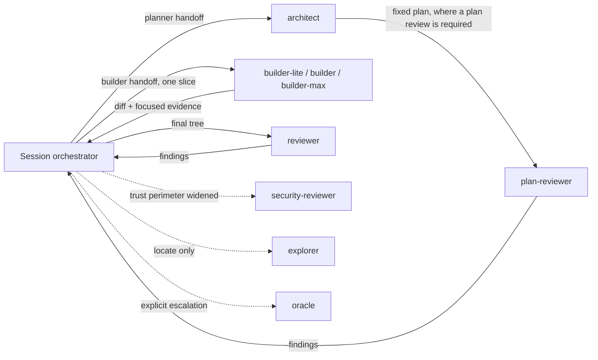

# The seats

Every job in the workflow belongs to a seat: an agent with a narrow charter and no more tools than the charter needs.
This page explains which seat does what, and how work is handed from one to another. This page is part of
[the workflow guide](AI-WORKFLOW.md). Related: [The life of one change](AI-WORKFLOW-job.md) for where each seat acts in
a job, and [The evidence bar](AI-WORKFLOW-evidence.md) for what a builder's report must prove.

## Mental model

| Seat | Job | Writes code? |
|---|---|---|
| `architect` | Plans a substantial change: approach, grounding, surface assessment, file-level plan cut into bounded builder handoffs | No |
| `plan-reviewer` | Reads the fixed plan before any builder starts, for feasibility, scope, coherence, and security | No |
| `builder-lite` | Executes a mechanical slice on a cheaper model when verification is strong and no judgment remains | Yes |
| `builder` | Executes one approved, bounded slice end to end when the plan leaves no consequential judgment | Yes |
| `builder-max` | The same charter at higher capability, chosen first whenever that materially reduces risk | Yes |
| `reviewer` | Adversarial review of the final diff: correctness, honesty, dead code, grounding, spec conformance | No |
| `security-reviewer` | Trust-perimeter review, only when a change widens a surface in the `security review` row of the Surfaces table in `AGENTS.md` | No |
| `explorer` | Fast read-only discovery on a cheaper model: where is X, who calls Y | No |
| `oracle` | Escalation-tier reasoning for novel design, independent derivation, or a stalled diagnosis; never a routine rung | No |

## How it works

The session that talks to the owner is the orchestrator. It plans the cards that need no architect, delegates
every edit to a builder seat, reviews, and delivers; it never builds. Each seat has a narrow charter and no more
tools than the charter needs. Which model and effort each seat runs at is set in its seat file, under
[`.claude/agents/`](../.claude/agents/) and [`.codex/agents/`](../.codex/agents/);
[`AGENTS.md`](../AGENTS.md) says under "Runtime notes" which seats the costliest models are kept to.

The diagram shows who hands what to whom: the orchestrator is the only seat that talks to every other seat,
builders receive one slice at a time, and the reviewers report findings back rather than fixing them.

In words: the orchestrator sends the architect a planner handoff. Where the card requires a plan review, the
architect's fixed plan goes to the plan-reviewer, which reports findings to the orchestrator. The orchestrator
then hands a builder one slice at a time and receives a diff with focused evidence. It sends the final tree to
the reviewer and receives findings. Only when the trust perimeter widens does it call the security-reviewer; the
explorer is called only to locate code, and the oracle only on explicit escalation.

A plan-first card's plan is read by the `plan-reviewer` charter before any builder starts. Which cards are
plan-first, which seat and model run that review, how a session on either runtime reaches it, and what happens
when it cannot be reached are in [the `resume` skill](../.agents/skills/resume/SKILL.md) under "4. Plan" and
[the `cross-review` skill](../.agents/skills/cross-review/SKILL.md) under "4. Review a plan before the build".

A handoff to a builder is a filled copy of `.claude/templates/builder-handoff.md`; to the architect, a filled
copy of `.agents/templates/planner-handoff.md`. [The builder template](../.claude/templates/builder-handoff.md) and
[the planner template](../.agents/templates/planner-handoff.md) each list the labelled lines a handoff must
carry, and the handoff hook refuses a handoff that drops one. A builder proves only its own slice: the full suite
and every commit stay with the orchestrator, as [the `resume` skill](../.agents/skills/resume/SKILL.md) sets out
under "5. Build".

Which seats read `docs/CODING-STANDARDS.md` before they start is a rule in [`AGENTS.md`](../AGENTS.md) under
"Coding standards and the executed test bar". The standards are more than a builder's style guide: they also set
what a test or tool may cost, and that choice is made in the plan. A builder cannot change a plan once it
arrives, so a standard read only by the builder and the reviewer reaches the work after the design it governs is
fixed, and a review finding then costs a replan.

## Where the rules live

- The seat files under [`.claude/agents/`](../.claude/agents/) and [`.codex/agents/`](../.codex/agents/): each
  seat's charter, tools, model, effort and turn cap.
- [`AGENTS.md`](../AGENTS.md) under "Runtime notes" and "Codex model routing": which seats exist, which seats the
  costliest models are kept to, and how a seat is dispatched.
- [`AGENTS.md`](../AGENTS.md) under "Coding standards and the executed test bar": which seats read the coding
  standards.
- [`.claude/templates/builder-handoff.md`](../.claude/templates/builder-handoff.md) and
  [`.agents/templates/planner-handoff.md`](../.agents/templates/planner-handoff.md): the labelled lines of each
  handoff.
- [The `resume` skill](../.agents/skills/resume/SKILL.md) under "4. Plan" and "5. Build": who plans, which plans are
  reviewed and by whom, and what a builder may run.
- [The `cross-review` skill](../.agents/skills/cross-review/SKILL.md): how a review or a plan review runs on the
  other model family.

## Failure modes

- **A builder is cut off at its turn cap.** Each Claude seat file also sets a turn cap. A builder is cut off at its
  cap with no warning, so a builder's report ends with a literal sentinel line; a report without it means the
  builder was capped, and the remaining work goes to a fresh builder as a smaller slice.
- **A handoff leaves a decision open.** Judgment that would make a handoff unreliable is resolved in the plan or
  the slice is split smaller; the session never absorbs it by editing, and a builder that meets it stops and asks
  ([`AGENTS.md`](../AGENTS.md) under "Runtime notes").
- **A handoff is incomplete.** The handoff hook refuses a handoff that is missing a labelled line or carries an
  unfilled slot, and a builder checks the same lines itself before it edits.
- **The plan-review seat cannot be reached.** Another seat reviews the plan instead and the pull request body
  says so; [the `resume` skill](../.agents/skills/resume/SKILL.md) owns that route under "4. Plan".

## Key files

- `.claude/agents/` and `.codex/agents/`: the seat files.
- `.claude/templates/builder-handoff.md` and `.agents/templates/planner-handoff.md`: the handoff templates.
- `.claude/hooks/check-builder-handoff.mjs`: the handoff hook.
- `docs/CODING-STANDARDS.md`: the standards every planning, building and reviewing seat reads.
