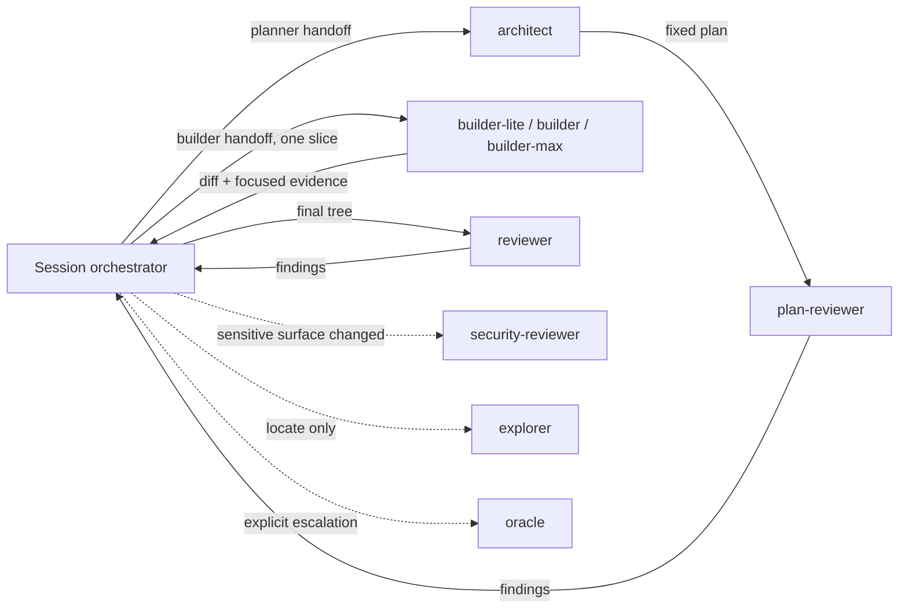
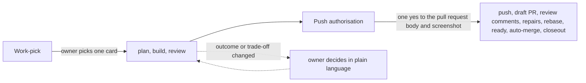
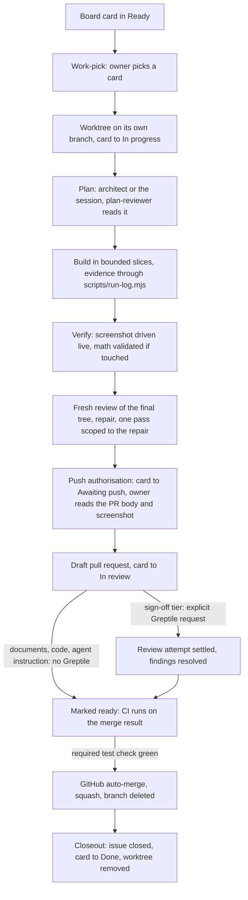

# The RentCottage software factory

RentCottage is built by AI agents under a workflow the owner steers from two decisions: what to build, and
whether a finished change may ship. Everything between those two decisions is done by agents, checked by
tests and reviews the agents cannot skip, and recorded where the owner can read it without reading code.

This guide explains that workflow to someone who has never opened the repository: what the pieces are, how a
change moves through them, what is enforced by a machine and what is only instructed by a sentence, and which
parts transfer to another product. `AGENTS.md` is the contract every agent loads; the skills under
`.agents/skills/` own the exact commands. This guide explains; it never duplicates a command sequence.

## Why it is shaped this way

An AI agent's characteristic failure is a plausible mistake, not a visible one: a metric that is
self-consistent and wrong, a test that passes whatever the code does, a pull request description that
overstates what was verified. The workflow is built around three answers to that.

- **Slice by blast radius.** Work is cut by how many behaviours, sources of truth, and consumers a change can
  affect, not by file size. Each slice makes one verifiable claim, fits one build context, and declares the
  files it owns. A one-line change to a shared resolver is riskier than a long isolated document.
- **Route capability by the judgment that remains.** After planning, ask what design choices are still open,
  how much is unknown, how bad a plausible defect would be, and how strongly tests can catch a weak
  implementation. A bounded builder takes work with no remaining judgment; remaining judgment is resolved in
  the plan or the slice is split, never absorbed by the session editing directly. Cost breaks ties only between
  equally reliable routes.
- **Treat evidence honestly.** A green check proves only what that check covers. A review with no comments is
  not a completed review. Missing evidence is reported as unavailable, never converted to a pass or a zero.

## Two runtimes, one contract

The factory runs on Claude Code and on Codex, and switches between them when one runs out of budget. Both read
the same manual: `AGENTS.md` is the contract, `CLAUDE.md` imports it and adds its own Claude-only notes. Skills
live once under `.agents/skills/`, with `.claude/skills/` holding symlinks into them. The agent seats under
`.claude/agents/` and `.codex/agents/` are maintained counterparts, so the two runtimes carry the same charters
with their runtime-specific configuration. The safety hooks exist as twins: `.claude/settings.json` wires the
Claude set, `.codex/hooks.json` the Codex set.

## The seats

The session that talks to the owner is the orchestrator. It plans the cards that need no architect, delegates
every edit to a builder seat, reviews, and delivers; it never builds. Each seat has a narrow charter and no more
tools than the charter needs. The costliest model of each family, Fable on Claude and Astra on Codex, sits only
in the `architect`, `oracle` and `security-reviewer` seats; the session and the builders run on the tier below.

| Seat | Job | Writes code? |
|---|---|---|
| `architect` | Plans a substantial change: approach, canon check, tripwire assessment, file-level plan cut into bounded builder handoffs | No |
| `plan-reviewer` | Reads the fixed plan before any builder starts, for feasibility, scope, coherence, and security | No |
| `builder-lite` | Executes a mechanical slice on a cheaper model when verification is strong and no judgment remains | Yes |
| `builder` | Executes one approved, bounded slice end to end when the plan leaves no consequential judgment | Yes |
| `builder-max` | The same charter at higher capability, chosen first whenever that materially reduces risk | Yes |
| `reviewer` | Adversarial review of the final diff: correctness, honesty, dead code, canon, spec conformance | No |
| `security-reviewer` | Sensitive-surface review for authentication, authorization, payments, personal data, database security, credentials, or injection boundaries | No |
| `explorer` | Fast read-only discovery on a cheaper model: where is X, who calls Y | No |
| `oracle` | Escalation-tier reasoning for novel design, independent derivation, or a stalled diagnosis; never a routine rung | No |



The diagram shows who hands what to whom: the orchestrator is the only seat that talks to every other seat,
builders receive one slice at a time, and the reviewers report findings back rather than fixing them.

A handoff to a builder is a filled copy of `.claude/templates/builder-handoff.md`; to the architect, a filled
copy of `.agents/templates/planner-handoff.md`. Each names the claim, the construction mode, the exact
focused verification command, and the stop condition. A builder never runs the full suite and never commits.

## The two owner gates

The owner reads pull request descriptions and screenshots, not diffs. The workflow therefore puts exactly two
decisions in front of the owner and phrases both in plain language.



1. **Work-pick** is the owner's pick of one row of the candidate table, which approves that card's outcome and
   acceptance criteria as written and starts the job; no criteria list is shown and no second yes is asked.
   Surfaces that carry product meaning (booking lifecycle, payment state, authorization, customer-visible copy,
   Arabic or Sorani layout, and accessibility) also need owner direction and an authority check here. A surface
   where a plausible wrong answer would expose money, access, or personal data needs explicit sign-off and a named
   anti-regression test.
2. **Push authorisation** is one yes to the filled pull request body and its screenshot, and any instruction
   to push counts as that yes. It covers the whole delivery: the push, the draft pull request, the comments
   that ask for the external review, repairs from it, rebasing onto `main` when it has moved, marking the
   pull request ready, the queued merge, and the closeout that follows it. The owner is not asked again.

A material change to the approved outcome goes back to the owner as a plain-language decision before it is
built. Destructive actions keep their own exact-target approval regardless of either gate.

## The life of one change



The diagram is the whole path from a card to a merged commit. In words:

- **Isolation.** Every issue gets its own git worktree on its own branch, with the session started inside it. On plain
  Claude Code and Codex both use a native sibling worktree beside the integration checkout, created from freshly
  fetched `origin/main`. A runtime's temporary subagent checkout is not the job worktree. One writer owns the job
  worktree at a time, and separate issues run only when their files, product seams, tests, and shared resources are
  demonstrably independent.
- **Evidence during the build.** Every executed check runs through `scripts/run-log.mjs`, which appends the
  real exit code to a per-branch log so the pull request body quotes what a script wrote, not what an agent
  remembers. Every green slice is committed on the job branch, so a crash costs at most the slice in progress.
- **Verification before review.** Visual work is driven live against the correct Next.js or Worker runtime and a
  current screenshot is shown in chat. Database, browser, payment, and provider work uses the preparation and
  observer rules in `docs/engineering/testing-strategy.md`.
- **Review in two layers.** One fresh review of the final tree before the pull request opens, by tier. Documents
  (product and engineering documentation plus `CONTEXT.md`) are reviewed by the session itself; the owner is their reader. Code and agent
  instruction, the manual, the rules, the skills and the seat files included, get the `reviewer` charter run by the
  model family that did not write the diff, dispatched through the `cross-review` skill: the Codex seat from a Claude
  session, the Claude seat from a Codex session, because a writer's own family shares its blind spots. When that
  family's seat cannot be reached, the pass runs on the writing family's own seat instead and the pull request body
  declares the substitution and how the unavailability was established; an undeclared substitution is a skip. Sign-off
  surfaces (authentication, authorization, payments, personal data, database security, credentials, and injection
  boundaries), and any diff where material
  uncertainty remains after that pass, get the same cross-family pass and then an explicit Greptile request on the
  finished draft, every thread fixed or dismissed with a reason before the draft is marked ready. `security-reviewer`
  runs only when a classified sensitive surface changes. `.greptile/config.json` disables automatic reviews;
  labels are metadata.
  The `resume` skill owns the tiers, the allowance lookup, the request, current-commit completion evidence, finding
  disposition, that cross-family substitution route and Greptile's own documented best-effort provider-unavailability
  exception. Repairs and rebases stay in draft and receive the applicable local evidence and, when required, a new
  Greptile attempt before CI. After two repair rounds that still produce true findings, the work is replanned or split
  rather than patched again.
- **Delivery by GitHub.** Marking the pull request ready after any required review attempt settles starts continuous
  integration. An unchanged-commit CI retry needs no further Greptile review. The merge is always queued as a GitHub auto-merge, which GitHub completes
  only when the required source-bound `test` check is green and conversations are resolved; no agent merges
  directly. The checked-in `sweep-scope` guard runs on pull-request events and immediately no-ops ordinary branches.
  It does not activate the documentation maintenance routine: its schedule, external environment, publication
  authority, provider, and required-check setting remain unconfigured.
- **Closeout.** The moment the merge lands, the same session confirms it, moves the card, pulls main, and
  removes the branch and worktree. Rulings the owner made during the session go to the issue or the manual
  that owns the topic, never to a new document.

The board is a GitHub Project with six columns: Backlog, Ready, In progress, Awaiting push, In review, Done.
Ready means startable in the next session with no missing owner decision, external dependency, or scheduled
date. Awaiting push is the gap between local review passing and push authorisation, before any push has
happened: a card there has legitimately produced no pull request yet. `scripts/board.mjs` lists the board and,
from the same read, reports a card whose column disagrees with its issue; `--closeout` is the strict gate
closeout runs. `scripts/board-move.mjs` moves a card; on a board with a parked lane, `--lane <issue#>:<option>`
parks a card in that lane and `--lane <issue#>:none` releases it, and on a board with no parked lane `--lane`
refuses before making any `gh` call.

For an issue's open-or-closed state, the scan reports a closed issue whose card is not in Done and an open issue
whose card is in Done. An open issue whose closing pull request has merged is a reopen, not shipped work: it is
judged by its open state and its column like any other open issue, never reported as shipped.

The toolkit (`scripts/board.mjs`, `board-add.mjs`, `board-move.mjs`, `verify-issue-publish.mjs` and
`scripts/lib/board.mjs`, `board-rules.mjs`, `board-config.mjs`, `board-add.mjs`, `board-move.mjs`,
`issue-publish.mjs`, `gh-exec.mjs`, `cli-flags.mjs`) copies unchanged into another repository; only
`scripts/lib/board-config.mjs` differs. It carries three settings that let the copy serve another board:

| Setting | This board | Effect |
|---|---|---|
| `BOARD_OWNER_TYPE` | `'user'` | `'organization'` makes every board read and write query the organisation that owns the project instead of a user. |
| `ROUTING_FIELD` with `ROUTING_OPTIONS` | `Workstream` with Go-to-market, Product, Platform | `null` with `[]` makes the board Status-only: the scan stops reporting a missing routing value, and `board-add.mjs` takes `<issue#> <Status>` alone. |
| `PARKED_LANE` | `null` | `{ field, option }` names a single-select field and one of its options; a card carrying that option keeps its column but is left out of the pick view, which lists it on its own `Parked (<field>: <option>), not pickable:` line instead. `board-move.mjs --lane` writes the lane. A parked card in an in-flight column is not reported as a claim with no closing pull request, since it waits on an answer from outside the session, while the blocked, unassigned and epic checks still judge it. `board.mjs --json` carries `parked` on every card, `false` on a board with no parked lane. |

Every `gh` call the toolkit makes runs through the argv prefix in the `BOARD_TOOLKIT_GH` environment variable, a
JSON array of strings that defaults to `["gh"]`; a malformed value throws rather than reaching the real CLI. The
name sits outside gh's own `GH_` variables. The gh-calling tests reach their stand-in through it
(`scripts/lib/fake-gh.mjs` sets it to Node plus a `.cjs` shim), never through PATH, because on Windows
`execFile("gh")` runs only `gh.exe` and an extensionless stand-in on PATH would be skipped in favour of live
GitHub.

The six columns read as four stages, the shape any GitHub Project reader can copy onto their own board:

| Stage | Columns |
|---|---|
| To-Do | Backlog, Ready |
| Active | In progress, In review |
| Wait | Awaiting push |
| Done | Done |

The project's Workflows page (the workflow icon in the project header, not the Settings sidebar) carries the
board's own automation, so no agent moves a card for these cases:

| Workflow | State | Setting | Why |
|---|---|---|---|
| Auto-add to project | On | `is:issue is:open` on this repository | A new issue is visible on the board before anyone triages it by hand |
| Item added to project | On | Status: Backlog | A card added by automation lands in Backlog, the same column `to-issues` and `resume` add to |
| Auto-add sub-issues to project | On | Default | An epic's decomposition shows up on the board without a manual add per slice |
| Item closed | On | Status: Done | The terminal move to Done happens without an agent or network access at merge time; `moveCards` reads it back and skips its own write when this already ran |
| Auto-archive items | On | `is:issue,pr is:closed updated:<@today-2w` | Keeps the active board small; a Done card is archived, never deleted, so history stays intact |
| Pull request linked to issue | Off | | Awaiting push and In review are `resume`'s calls, tied to push authorisation and the draft actually opening, not merely a link existing |
| Pull request merged | Off | | The issue's own close, through the pull request's `Closes #` line, already triggers Item closed |
| Item reopened | Off | | A reopen is the Returned quality signal the session records deliberately; an automatic reversion would fight the Awaiting-push/In-review sequencing |
| Code changes requested | Off | | Review state is tracked by the `resume` skill's own evidence bar (fresh review, Greptile where required), not by the board |
| Code review approved | Off | | The same evidence bar as Code changes requested |
| Auto-close issue | Off | | Closing an issue follows the pull request's `Closes #` line, never inferred from a card's column |

A card that automation adds has no Workstream; `scripts/board.mjs` reports it until
`node scripts/board-add.mjs <issue> Backlog <Workstream>` fills the field on the existing card.

## The review line

Every pull request the `resume` skill delivers carries exactly one review line, so the review run before the pull
request opened is readable on GitHub. This section is the specification: any tool that writes or parses the line,
in this repository or another, follows it, and a tool that disagrees with it is the defect. The weekly
inactive documentation sweep and triage routines carry no line because they run no review before their pull
requests open.

```
Review: tier=code rounds=2 raised=6 fixed=4 dismissed=1 deferred=1
```

| Field | Value |
|---|---|
| `tier` | `document`, `code` or `sign-off`: the review tier the `resume` skill assigned. A pass run on the writing family's seat because the other family was unavailable keeps its tier; the pull request body declares the substitution |
| `rounds` | Reviewer passes over the tree, at least 1: the fresh review, each pass scoped to a repair, each `security-reviewer` pass, and each Greptile review of a commit count one each |
| `raised` | Findings reported across every round, Greptile's included, a finding reported more than once counted once; in a self-review, the findings the session records in the Review section. A candidate the reviewer discarded itself is not one |
| `fixed` | Raised findings repaired in this pull request |
| `dismissed` | Raised findings judged false and dismissed with a reason |
| `deferred` | True findings not fixed here, each carried to a follow-up card or set aside by the owner, as the Review section names |

The line is exactly the six fields in this order, beginning at the start of a line with `Review: ` and ending after
the `deferred` value; trailing whitespace and a carriage return are ignored. Fields are separated by single spaces,
each written as the lowercase name, `=`, and a value with no spaces. Counts are whole numbers with no leading
zeros. Every finding is settled before merge, so `raised` equals `fixed` plus `dismissed` plus `deferred`. Lines
inside fenced code blocks or HTML comments are not review lines, and a body carrying more than one valid line is
invalid.

## Enforced or instructed

Most of the workflow is a sentence an agent follows. A short list is enforced by a machine, chosen because a
sentence had failed to prevent it or because the bad state would be silent or hard to reverse.

| Protection | Mechanism | What it refuses or forces |
|---|---|---|
| No unsafe git or GitHub command | `.claude/hooks/block-unsafe-git.mjs` before every shell command (Codex twin under `.codex/hooks/`) | `--no-verify`, force pushes, history rewrites, a non-draft pull request, a merge that is not a GitHub auto-merge, and branch work in the root checkout; a quoted mention or a heredoc body is data, and a wrapped or disguised invocation is not modelled |
| A builder receives a bounded handoff | `.claude/hooks/check-builder-handoff.mjs` before every agent spawn | A handoff missing a required field, with an unfilled slot, or telling the builder to prove its own mutation |
| Green before a turn ends | `.claude/hooks/verify-green.sh` at turn end | Finishing after a pending `src/` edit without running lint, or with a lint error |
| Runner output stays readable | `.claude/hooks/filter-test-output.mjs` | Condenses a green run, passes a red run through in full |
| Staged agent instructions stay valid | `.githooks/pre-commit` and `.githooks/pre-merge-commit` | A commit whose staged seat definitions fail validation, including deletion of the staged validator |
| Agent definitions parse and the reviewer charter matches | `.githooks/pre-commit` | A staged seat file the runtime would drop silently, and Claude and Codex reviewer charters that differ beyond the skill-invocation sigil |
| Lint and the script suite pass | `.githooks/pre-push` | A push with a red script suite |
| Only green code merges | Branch protection on `main` requiring the source-bound `test` check, current-base strictness, conversation resolution, and auto-merge | A merge before the current merge result is green and its conversations are resolved |
| Metered suites run on purpose | `.codex/rules/playwright.rules` | A browser run on Codex without a prompt |

Committed hook code and registered configuration prove the repository contract, not that an already-running
runtime loaded or trusted that configuration. When activation cannot be observed, report that limit explicitly.

Everything else, including which reviewer runs, when to stop and replan, and what the pull request body must
say, is a sentence in `AGENTS.md` or a skill. The bar for adding a new mechanism is stated in `AGENTS.md`
under "Publication and machinery": a control failure a sentence could not prevent twice, the same friction
across three independent jobs, a required new integration, or externally imposed drift. A native feature beats
custom code, a hook beats a script, a sentence beats a hook.

## The evidence bar

`docs/engineering/testing-strategy.md` owns this. Every coherent claim in a change gets one construction mode:

| Mode | When | What it requires |
|---|---|---|
| `strict-tdd` | A reproducible defect with a meaningful observer, or an executable security, control, or closeout invariant | The test first, red, then the fix, green |
| `evidence-required` | The default for new or changed behaviour or policy | New or strengthened evidence in the same change, order flexible |
| `preservation` | No observable behaviour changed and the protected contract is untouched | The existing regression net named, nothing new |

Unless the mode is `preservation`, each claim also gets one executed mutation: the fix is reverted or the
guard removed, the focused test goes red, the change is restored, the test goes green, and all four exit
codes land in the run log. A test that stays green when the feature breaks is not evidence.

Continuous integration, defined in `.github/workflows/ci.yml`, uses `scripts/verify.mjs` to classify the complete
diff and run the applicable baseline, database, and browser evidence. CI runs from the merge result rather than
only the branch head, so it tests what would land. The selector fails loud on an unclassified path, malformed Git
evidence, or a dependency preflight mismatch.

The tracked `sweep-scope` workflow is a pull-request guard: it runs on pull-request events, no-ops branches outside
the sweep and triage prefixes, and reads the scope table from the base commit so a branch cannot widen its own
authority. Its context-free half refuses concealed destinations on added lines; its semantic half parses each
complete document before and after as GitHub Flavoured Markdown and refuses a newly rendered destination that the
base tree cannot vouch for as a whole token. On judged branches only, the workflow installs the four exact parser
pins from the base branch's own lock with `npm ci --omit=dev --ignore-scripts --no-audit --no-fund`; it keeps
repository permission read-only, disables persisted checkout credentials, and executes no pull-request code. A
registry outage therefore fails the check closed until the service is restored and the check is rerun. The five
accepted parser, repository-fixture, reporting, and deliberately blunt refusal gaps are named in
`docs/DOC-SWEEP.md` and tracked by [Flowgauge issue
#1362](https://github.com/zaingulel/flow-metrics-dashboard/issues/1362). The guard's presence does not activate the
documentation maintenance routine or configure its schedule, external environment, publication authority,
provider, or hosted required-check setting. Those need the external setup listed in `docs/DOC-SWEEP.md` and owner
authority.

## Sources of truth

| Question | Where the answer is |
|---|---|
| What is planned, and in what state | The GitHub Project board |
| What has shipped | `git log` and passing checks, never a prose claim |
| What is in flight | A branch and its draft pull request; its body's "Not done" section is the handoff |
| What the rules are | `AGENTS.md`, the scoped rules, `CONTEXT.md`, `docs/engineering/testing-strategy.md`, `docs/engineering/coding-standards.md` |
| What happened | Git history |
| What the code means, in prose | `CONTEXT.md`, accepted architecture decisions, `docs/agents/domain.md`, and the applicable product and engineering authorities |

A chat claim never overrides these. A claim that work shipped is checked against the commit and the checks;
a claim that work is next is checked against the board.

## Keeping it small

The factory once carried its own ledger of workflow state, and maintaining that ledger consumed more effort
than the product it was built to deliver. The rule that came out of that: when a real failure exposes a
weakness, preserve the lesson at the cheapest layer that would have caught it. A sentence in the manual
first; evidence when behaviour can demonstrate the failure; a deterministic guard only when the failure recurs
despite the sentence, or immediately when the bad state is silent, misleading, security-sensitive, or hard to
reverse. Every new guard names its non-destructive recovery route in the same change. New controls replace
stale guidance rather than adding a second authority.

## What transfers beyond RentCottage

The transferable core is compact:

1. One contract file both runtimes read, with skills for the steps and hooks for what must never happen.
2. Two human gates, phrased for a reader of prose: what to build, and whether the finished change may ship.
3. One worktree and one draft pull request per issue; the platform's own auto-merge as the only merge.
4. Seats with narrow charters, bounded handoffs through a template, and judgment settled in the plan rather than
   absorbed by the session.
5. One construction mode and one executed mutation per claim, with exit codes recorded by a script.
6. A fresh review of the final tree, independent for code, then an external reviewer on the draft, then CI on ready.
7. A board, git, and documentation as three distinct stores, reconciled rather than assumed consistent.
8. Evidence limits as visible as evidence successes.

RentCottage-specific protections, such as PostgreSQL-authoritative booking and payment state, Row Level Security,
authentication, trilingual interfaces, accessibility, migration safety, and Worker compatibility, are replaced by
the highest-consequence invariants of whatever product adopts the workflow.
