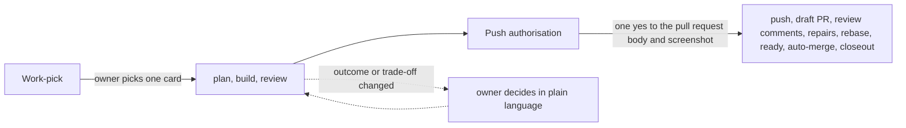
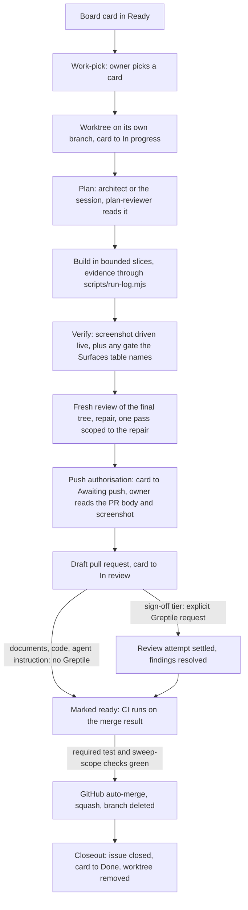

# The software factory

This repository is built by AI agents under a workflow the owner steers from two decisions: what to build, and
whether a finished change may ship. Everything between those two decisions is done by agents, checked by
tests and reviews the agents cannot skip, and recorded where the owner can read it without reading code.

This guide explains that workflow to someone who has never opened the repository: what the pieces are, how a
change moves through them, what is enforced by a machine and what is only instructed by a sentence, and which
parts transfer to another product. `AGENTS.md` is the contract every agent loads; the skills under
`.agents/skills/` own the exact commands. This guide explains; it never duplicates a command sequence.

## Why it is shaped this way

An AI agent's characteristic failure is a plausible mistake, not a visible one: a result that is
self-consistent and wrong, a test that passes whatever the code does, a pull request description that
overstates what was verified. The workflow is built around three answers to that.

- **Slice by blast radius.** Work is cut by how many behaviours, sources of truth, and consumers a change can
  affect, not by file size. Each slice makes one verifiable claim, fits one build context, and declares the
  files it owns. A one-line change to a shared resolver is riskier than a long isolated document.
- **Route capability by the judgment that remains.** After planning, ask what design choices are still open,
  how much is unknown, how bad a plausible defect would be, and how strongly tests can catch a weak
  implementation. A bounded builder takes work with no remaining judgment; remaining judgment is resolved in
  the plan or the slice is split, never absorbed by the session editing directly. Cost breaks ties only between
  equally reliable routes.
- **Treat evidence honestly.** A green check proves only what that check covers. A review with no comments is
  not a completed review. Missing evidence is reported as unavailable, never converted to a pass or a zero.

## Two runtimes, one contract

The factory runs on Claude Code and on Codex, and switches between them when one runs out of budget. Both read
the same manual: `AGENTS.md` is the contract, `CLAUDE.md` imports it and adds its own Claude-only notes. Skills
are written under `.agents/skills/`, which Codex reads directly, and `.claude/skills/` holds a byte-identical
copy of each for Claude Code; they are real copies rather than symlinks so they survive a Windows checkout. Ten
of those skills are themselves copied whole from `.agents/upstream/mattpocock-skills/`, a verbatim vendored copy
of an upstream skill set kept with its own licence, so a vendored skill is invoked by the same name and reached
by the same path as a first-party one. `AGENTS.md` owns which upstream commit that
copy pins and how it is refreshed. The agent seats under `.claude/agents/` and `.codex/agents/` are
maintained counterparts, with shared charters kept aligned across the two runtime formats. The safety hooks
exist as twins: `.claude/settings.json` wires the Claude set, `.codex/hooks.json` the Codex set.

On native Windows both runtimes need Git for Windows. Claude Code runs its hook commands through Git Bash (the
Claude hooks are unchanged; `CLAUDE_CODE_GIT_BASH_PATH` points it at a non-default install), and the `.sh` hooks and
their tests run through its `sh.exe`, which `scripts/lib/posix-shell.mjs` locates. Codex uses each handler's
`commandWindows` on Windows and runs it through the session's PowerShell as `-NoProfile -Command`; each form
resolves the hook path first, falling back to the working directory when git cannot answer as the macOS form does,
seeds `$LASTEXITCODE = 1` immediately before `node`, and ends `exit $LASTEXITCODE`, because PowerShell otherwise
turns an exit 2 block into 1 and a missing `node` into a silent pass. The Stop hook's Windows form runs
`.codex/hooks/verify-green.mjs`, which runs the same `verify-green.sh` through that shell and blocks when none is
found. The `.sh` hooks need LF endings, which each hook directory's own `.gitattributes` keeps.
`scripts/lib/codex-hooks-windows.test.mjs` runs each registered form through PowerShell wherever one is on PATH, so
a Windows CI runner proves the repository's contract, not that a running Codex fired it. Two upstream limits stand:
Codex does not yet emit `PreToolUse` for shell commands on Windows (openai/codex#24453), and there its shell payload
wraps the command in a `powershell.exe -Command` string the git guard does not read. A hook that cannot run, because
`node` is missing or because a Codex that finds no shell launches hooks through `cmd.exe /C`, which cannot read
these forms, is reported as a failed hook and the action proceeds, as a failed hook does on macOS: the failure is
visible, not blocking. Changing a hook definition resets Codex's trust in it: run `/hooks` in Codex at the
repository root to trust it again.

## The seats

The session that talks to the owner is the orchestrator. It plans the cards that need no architect, delegates
every edit to a builder seat, reviews, and delivers; it never builds. Each seat has a narrow charter and no more
tools than the charter needs. The costliest model of each family, Fable on Claude and Astra on Codex, sits only
in the `architect`, `oracle` and `security-reviewer` seats; the session and the builders run on the tier below.

| Seat | Job | Writes code? |
|---|---|---|
| `architect` | Plans a substantial change: approach, grounding, surface assessment, file-level plan cut into bounded builder handoffs | No |
| `plan-reviewer` | Reads the fixed plan before any builder starts, for feasibility, scope, coherence, and security | No |
| `builder-lite` | Executes a mechanical slice on a cheaper model when verification is strong and no judgment remains | Yes |
| `builder` | Executes one approved, bounded slice end to end when the plan leaves no consequential judgment | Yes |
| `builder-max` | The same charter at higher capability, chosen first whenever that materially reduces risk | Yes |
| `reviewer` | Adversarial review of the final diff: correctness, honesty, dead code, grounding, spec conformance | No |
| `security-reviewer` | Trust-perimeter review, only when a change widens a surface in the `security review` row of the Surfaces table in `AGENTS.md` | No |
| `explorer` | Fast read-only discovery on a cheaper model: where is X, who calls Y | No |
| `oracle` | Escalation-tier reasoning for novel design, independent derivation, or a stalled diagnosis; never a routine rung | No |


The diagram shows who hands what to whom: the orchestrator is the only seat that talks to every other seat,
builders receive one slice at a time, and the reviewers report findings back rather than fixing them.

A handoff to a builder is a filled copy of `.claude/templates/builder-handoff.md`; to the architect, a filled
copy of `.agents/templates/planner-handoff.md`. Each names the claim, the construction mode, the exact
focused verification command, and the stop condition. A builder never runs the full suite and never commits.

## The two owner gates

The owner reads pull request descriptions and screenshots, not diffs. The workflow therefore puts exactly two
decisions in front of the owner and phrases both in plain language.



1. **Work-pick** is the owner's pick of one row of the candidate table, which approves that card's outcome and
   acceptance criteria as written and starts the job; no criteria list is shown and no second yes is asked.
   Owner-directed surfaces are the Surfaces table's `owner-directed` row and also need owner direction and
   grounding here; sign-off surfaces are its `sign-off` row and need explicit sign-off and a named
   anti-regression test.
2. **Push authorisation** is one yes to the filled pull request body and its screenshot, and any instruction
   to push counts as that yes. It covers the whole delivery: the push, the draft pull request, the comments
   that ask for the external review, repairs from it, rebasing onto `main` when it has moved, marking the
   pull request ready, the queued merge, and the closeout that follows it. The owner is not asked again.

A material change to the approved outcome goes back to the owner as a plain-language decision before it is
built. Destructive actions keep their own exact-target approval regardless of either gate.

## The life of one change



The diagram is the whole path from a card to a merged commit. In words:

- **Isolation.** Every issue gets its own git worktree on its own branch, with the session started inside it. On plain
  Claude Code (`git worktree add`) and on Herdr it lives in the repository's gitignored `.claude/worktrees/`; on Codex
  it is the Codex-managed worktree or a sibling worktree beside the repository. A runtime's own subagent worktree is
  not that worktree: it branches from `main` rather than from the job branch, so builders never run in one. Two issues
  in two terminals never share a working file; two slices of one issue with disjoint files can run in two worktrees
  cut from the job branch and merge back with git. A generated artifact the `generated artifacts` row of the
  Conventions table in `AGENTS.md` names is never hand-merged, and the hooks keep it from landing stale.
- **Evidence during the build.** Every executed check runs through `scripts/run-log.mjs`, which appends the
  real exit code to a per-branch log so the pull request body quotes what a script wrote, not what an agent
  remembers. Every green slice is committed on the job branch, so a crash costs at most the slice in progress.
- **Verification before review.** Visual work is driven as the Conventions table's `visual verification` row says
  and a current screenshot is shown in chat; any further gate the Surfaces table names runs here.
- **Review in two layers.** One fresh review of the final tree before the pull request opens, by tier. Documents
  (`docs/`, the root readme, `CONTEXT.md`) are reviewed by the session itself; the owner is their reader. Code and agent
  instruction, the manual, the rules, the skills and the seat files included, get the `reviewer` charter run by the
  model family that did not write the diff, dispatched through the `cross-review` skill: the Codex seat from a Claude
  session, the Claude seat from a Codex session, because a writer's own family shares its blind spots. When that
  family's seat cannot be reached, the pass runs on the writing family's own seat instead and the pull request body
  declares the substitution and how the unavailability was established; an undeclared substitution is a skip. Sign-off
  surfaces (the Surfaces table's `sign-off` row), and any diff where material
  uncertainty remains after that pass, get the same cross-family pass and then an explicit Greptile request on the
  finished draft, every thread fixed or dismissed with a reason before the draft is marked ready. `security-reviewer`
  runs only when a change widens a surface in the Surfaces table's `security review` row. `.greptile/config.json` disables automatic reviews; labels are metadata.
  The `resume` skill owns the tiers, the allowance lookup, the request, current-commit completion evidence, finding
  disposition, that cross-family substitution route and Greptile's own documented best-effort provider-unavailability
  exception. Repairs and rebases stay in draft and receive the applicable local evidence and, when required, a new
  Greptile attempt before CI. When two repair rounds still produce true findings, the `resume` skill's Build section
  decides between one more round and an owner decision.
- **Delivery by GitHub.** Marking the pull request ready after any required review attempt settles starts continuous
  integration. An unchanged-commit CI retry needs no further Greptile review. The merge is always queued as a GitHub auto-merge, which GitHub completes
  only when the required `test` and `sweep-scope` checks are green; no agent merges directly. The two documentation
  routines, when the Conventions table marks them active, are the one exception their manuals state: the sweep and
  its day-after triage each squash-merge
  their own pull request through the GitHub API tooling, and only once both required checks have succeeded on its
  exact head.
- **Closeout.** The moment the merge lands, the same session confirms it, moves the card, pulls main, and
  removes the branch and worktree. Rulings the owner made during the session go to the issue or the manual
  that owns the topic, never to a new document.

The board is a GitHub Project with six columns: Backlog, Ready, In progress, Awaiting push, In review, Done.
Ready means startable in the next session with no missing owner decision, external dependency, or scheduled
date. Awaiting push is the gap between local review passing and push authorisation, before any push has
happened: a card there has legitimately produced no pull request yet. `scripts/board.mjs` lists the board and,
from the same read, reports a card whose column disagrees with its issue; `--closeout` is the strict gate
closeout runs. `scripts/board-move.mjs` moves a card; on a board with a parked lane, `--lane <issue#>:<option>`
parks a card in that lane and `--lane <issue#>:none` releases it, and on a board with no parked lane `--lane`
refuses before making any `gh` call.

For an issue's open-or-closed state, the scan reports a closed issue whose card is not in Done and an open issue
whose card is in Done. An open issue whose closing pull request has merged is a reopen, not shipped work: it is
judged by its open state and its column like any other open issue, never reported as shipped.

The toolkit (`scripts/board.mjs`, `board-add.mjs`, `board-move.mjs`, `verify-issue-publish.mjs` and
`scripts/lib/board.mjs`, `board-rules.mjs`, `board-config.mjs`, `board-add.mjs`, `board-move.mjs`,
`issue-publish.mjs`, `gh-exec.mjs`, `cli-flags.mjs`) copies unchanged into another repository; only
`scripts/lib/board-config.mjs` differs. It holds this repository's own values for three settings that let the copy
serve another board:

| Setting | Effect |
|---|---|
| `BOARD_OWNER_TYPE` | `'organization'` makes every board read and write query the organisation that owns the project instead of a user. |
| `ROUTING_FIELD` with `ROUTING_OPTIONS` | `null` with `[]` makes the board Status-only: the scan stops reporting a missing routing value, and `board-add.mjs` takes `<issue#> <Status>` alone. |
| `PARKED_LANE` | `{ field, option }` names a single-select field and one of its options; a card carrying that option keeps its column but is left out of the pick view, which lists it on its own `Parked (<field>: <option>), not pickable:` line instead. `board-move.mjs --lane` writes the lane. A parked card in an in-flight column is not reported as a claim with no closing pull request, since it waits on an answer from outside the session, while the blocked, unassigned and epic checks still judge it. `board.mjs --json` carries `parked` on every card, `false` on a board with no parked lane. |

Every `gh` call the toolkit makes runs through the argv prefix in the `BOARD_TOOLKIT_GH` environment variable, a
JSON array of strings that defaults to `["gh"]`; a malformed value throws rather than reaching the real CLI. The
name sits outside gh's own `GH_` variables. The gh-calling tests reach their stand-in through it
(`scripts/lib/fake-gh.mjs` sets it to Node plus a `.cjs` shim), never through PATH, because on Windows
`execFile("gh")` runs only `gh.exe` and an extensionless stand-in on PATH would be skipped in favour of live
GitHub.

The six columns read as four stages, the shape any GitHub Project reader can copy onto their own board:

| Stage | Columns |
|---|---|
| To-Do | Backlog, Ready |
| Active | In progress, In review |
| Wait | Awaiting push |
| Done | Done |

The project's Workflows page (the workflow icon in the project header, not the Settings sidebar) carries the
board's own automation, so no agent moves a card for these cases:

| Workflow | State | Setting | Why |
|---|---|---|---|
| Auto-add to project | On | `is:issue is:open` on this repository | A new issue is visible on the board before anyone triages it by hand |
| Item added to project | On | Status: Backlog | A card added by automation lands in Backlog, the same column `to-issues` and `resume` add to |
| Auto-add sub-issues to project | On | Default | An epic's decomposition shows up on the board without a manual add per slice |
| Item closed | On | Status: Done | The terminal move to Done happens without an agent or network access at merge time; `moveCards` reads it back and skips its own write when this already ran |
| Auto-archive items | On | `is:issue,pr is:closed updated:<@today-2w` | Keeps the active board small; a Done card is archived, never deleted, so history stays intact |
| Pull request linked to issue | Off | | Awaiting push and In review are `resume`'s calls, tied to push authorisation and the draft actually opening, not merely a link existing |
| Pull request merged | Off | | The issue's own close, through the pull request's `Closes #` line, already triggers Item closed |
| Item reopened | Off | | A reopen is the Returned quality signal the session records deliberately; an automatic reversion would fight the Awaiting-push/In-review sequencing |
| Code changes requested | Off | | Review state is tracked by the `resume` skill's own evidence bar (fresh review, Greptile where required), not by the board |
| Code review approved | Off | | The same evidence bar as Code changes requested |
| Auto-close issue | Off | | Closing an issue follows the pull request's `Closes #` line, never inferred from a card's column |

On a board with a routing field, a card that automation adds has no routing value; `scripts/board.mjs` reports it
until `node scripts/board-add.mjs <issue> Backlog <value>` fills the field on the existing card, choosing the value
by the convention in `docs/ISSUE-TRACKER.md`.

## The review line

Every pull request the `resume` skill delivers carries exactly one review line, so the review run before the pull
request opened is readable on GitHub. This section is the specification: any tool that writes or parses the line,
in this repository or another, follows it, and a tool that disagrees with it is the defect. The
documentation sweep and its day-after triage run no review before their pull requests open and carry no line.

```
Review: tier=sign-off rounds=7 raised=16 fixed=13 dismissed=2 deferred=1 greptile_rounds=2 greptile_raised=1 greptile_true=1
```

| Field | Value |
|---|---|
| `tier` | `document`, `code` or `sign-off`: the review tier the `resume` skill assigned. A pass run on the writing family's seat because the other family was unavailable keeps its tier; the pull request body declares the substitution |
| `rounds` | Reviewer passes over the tree, at least 1: the fresh review, each pass scoped to a repair, each `security-reviewer` pass, and each Greptile review of a commit count one each |
| `raised` | Findings reported across every round, Greptile's included, a finding reported more than once counted once; in a self-review, the findings the session records in the Review section. A candidate the reviewer discarded itself is not one |
| `fixed` | Raised findings repaired in this pull request |
| `dismissed` | Raised findings judged false and dismissed with a reason |
| `deferred` | True findings not fixed here, each carried to a follow-up card or set aside by the owner, as the Review section names |
| `greptile_rounds` | Greptile reviews of a commit, a share of `rounds` and already counted in it |
| `greptile_raised` | Findings Greptile reported, a share of `raised` and already counted in it |
| `greptile_true` | Greptile findings fixed or deferred rather than dismissed as false, a share of `greptile_raised` |

The line is exactly the nine fields in this order, beginning at the start of a line with `Review: ` and ending
after the `greptile_true` value; trailing whitespace and a carriage return are ignored. Fields are separated by
single spaces, each written as the lowercase name, `=`, and a value with no spaces. Counts are whole numbers with
no leading zeros. Every finding is settled before merge, so `raised` equals `fixed` plus `dismissed` plus
`deferred`. `greptile_rounds` never exceeds `rounds`, `greptile_raised` never exceeds `raised`, `greptile_true`
never exceeds `greptile_raised`, `greptile_true` never exceeds `fixed` plus `deferred`, and `greptile_raised` minus
`greptile_true` never exceeds `dismissed`: Greptile's true findings are among the fixed or deferred ones and its
false findings among the dismissed ones. A pull request Greptile never reviewed, because its tier requests no
Greptile review or every attempt was `UNAVAILABLE`, carries `greptile_rounds=0` and therefore `greptile_raised=0`;
that reads as Greptile did not look, never as a clean Greptile review. Lines inside fenced code blocks or HTML
comments are not review lines, and a body carrying more than one valid line is invalid.

## Enforced or instructed

Most of the workflow is a sentence an agent follows. A short list is enforced by a machine, chosen because a
sentence had failed to prevent it or because the bad state would be silent or hard to reverse.

| Protection | Mechanism | What it refuses or forces |
|---|---|---|
| No unsafe git or GitHub command | `.claude/hooks/block-unsafe-git.mjs` before every shell command (Codex twin under `.codex/hooks/`) | `--no-verify`, force pushes, history rewrites, a non-draft pull request, a merge that is not a GitHub auto-merge, and branch work in the root checkout; a quoted mention or a heredoc body is data, and a wrapped or disguised invocation is not modelled |
| A builder receives a bounded handoff | `.claude/hooks/check-builder-handoff.mjs` before every agent spawn | A handoff missing a required field, with an unfilled slot, or telling the builder to prove its own mutation |
| Green before a turn ends | `.claude/hooks/verify-green.sh` at turn end, in the checkout the session is working in (Codex twin under `.codex/hooks/`) | Finishing with a lint error; a check it could not run, because no project root resolved or a tool is absent, is stated as unverified rather than passed silently |
| The product's own checks pass | The product gates `scripts/gates/{stop,pre-commit}`: `stop` run by both Stop hooks on every turn end, and `pre-commit` run by `.githooks/pre-commit` on every commit | A turn end or commit whose product gate, when present, exits non-zero or is not executable; an absent gate changes nothing |
| Runner output stays readable | `.claude/hooks/filter-test-output.mjs` | Condenses a green run, passes a red run through in full |
| The artifact matches its source | The product gates `scripts/gates/{stop,pre-commit}` (run on a merge that auto-commits through `.githooks/pre-merge-commit`), and CI | A turn end, commit or merge whose generated artifact, as the Conventions table names it, is not the byte-identical build of its source |
| Agent definitions parse and the reviewer charter matches | `.githooks/pre-commit` | A staged seat file the runtime would drop silently, and Claude and Codex reviewer charters that differ beyond the skill-invocation sigil |
| Lint and the script suite pass | `.githooks/pre-push` | A push with a red script suite |
| Shared workflow files match the manifest | `scripts/lib/workflow-contract.test.mjs`, run by `.githooks/pre-push` and CI | A push or merge where any file `.agents/factory-manifest.json` lists differs from its recorded hash; the failure names both fix routes, `--write` in the canonical repository and a sync in an adopter |
| Only green code merges | Branch protection on `main` requiring the `test` and `sweep-scope` checks, and auto-merge | A merge before both checks are green; on a draft the `test` gate reports under a different name so it can never satisfy the rule |
| Metered suites run on purpose | `.codex/rules/playwright.rules` | A browser run on Codex without a prompt |

Committed and registered hook configuration proves this repository contract; it does not prove that an
already-running runtime loaded or trusted that configuration. When the active runtime cannot be observed,
the delivery report still names that limit.

Everything else, including which reviewer runs, when to stop and replan, and what the pull request body must
say, is a sentence in `AGENTS.md` or a skill. The bar for adding a new mechanism is stated in `AGENTS.md`
under "Publication and machinery": a control failure a sentence could not prevent twice, the same friction
across three independent jobs, a required new integration, or externally imposed drift. A native feature beats
custom code, a hook beats a script, a sentence beats a hook.

## The evidence bar

`docs/TESTING-STRATEGY.md` owns this. Every coherent claim in a change gets one construction mode:

| Mode | When | What it requires |
|---|---|---|
| `strict-tdd` | A reproducible defect with a meaningful observer, or a subject rule `docs/TESTING-STRATEGY.md` names that demands it | The test first, red, then the fix, green |
| `evidence-required` | The default for new or changed behaviour or policy | New or strengthened evidence in the same change, order flexible |
| `preservation` | No observable behaviour changed and the protected contract is untouched | The existing regression net named, nothing new |

Unless the mode is `preservation`, each claim also gets one executed mutation: the fix is reverted or the
guard removed, the focused test goes red, the change is restored, the test goes green, and all four exit
codes land in the run log. A test that stays green when the feature breaks is not evidence.

CI runs the suites `docs/TESTING-STRATEGY.md` names. CI runs from the merge result, not the branch head, so it
tests what would land.

A second required check, `sweep-scope` in `.github/workflows/sweep-scope.yml`, exists because the
documentation sweep and its day-after triage, when active, land their own pull requests and no one reads them first. It runs
from `main` on every pull request rather than from the pull request it judges, passes at once off a
`docs-sweep/` or `docs-triage/` branch, and on one runs `scripts/sweep-scope-check.mjs`, which reads the
sweep's scope table from the base commit, the one allowlist both routines answer to, and fails the branch's
own changes on anything but a modification of a may-edit file, on any URI, or host name on a common top-level
domain, that the tree did not already carry, and on any destination shape that hides where it points; a second half
then renders each document before and after with GitHub Flavoured Markdown's own parser and refuses a newly
rendered destination the tree cannot vouch for, within the limits `docs/DOC-SWEEP.md` names.

## Sources of truth

| Question | Where the answer is |
|---|---|
| What is planned, and in what state | The GitHub Project board |
| What has shipped | `git log` and passing checks, never a prose claim |
| What is in flight | A branch and its draft pull request; its body's "Not done" section is the handoff |
| What the rules are | `AGENTS.md`, the scoped rules, and the documents `docs/README.md` indexes |
| What happened | Git history |
| What the code means, in prose | This guide and the documents `docs/README.md` indexes, kept true, when the Conventions table marks the documentation routines active, by the sweep in `docs/DOC-SWEEP.md`, whose reported findings the day-after triage in `docs/SWEEP-TRIAGE.md` resolves |

A chat claim never overrides these. A claim that work shipped is checked against the commit and the checks;
a claim that work is next is checked against the board.

## Keeping it small

The factory once carried its own ledger of workflow state, and maintaining that ledger consumed more effort
than the product it was built to deliver. The rule that came out of that: when a real failure exposes a
weakness, preserve the lesson at the cheapest layer that would have caught it. A sentence in the manual
first; evidence when behaviour can demonstrate the failure; a deterministic guard only when the failure recurs
despite the sentence, or immediately when the bad state is silent, misleading, security-sensitive, or hard to
reverse. Every new guard names its non-destructive recovery route in the same change. New controls replace
stale guidance rather than adding a second authority.

## What transfers beyond this repository

The transferable core is compact:

1. One contract file both runtimes read, with skills for the steps and hooks for what must never happen.
2. Two human gates, phrased for a reader of prose: what to build, and whether the finished change may ship.
3. One worktree and one draft pull request per issue; the platform's own auto-merge as the only merge.
4. Seats with narrow charters, bounded handoffs through a template, and judgment settled in the plan rather than
   absorbed by the session.
5. One construction mode and one executed mutation per claim, with exit codes recorded by a script.
6. A fresh review of the final tree, independent for code, then an external reviewer on the draft, then CI on ready.
7. A board, git, and documentation as three distinct stores, reconciled rather than assumed consistent.
8. Evidence limits as visible as evidence successes.

Product-specific protections are the surfaces the Surfaces table names; each product that adopts the workflow
fills that table with its own highest-consequence invariants.
