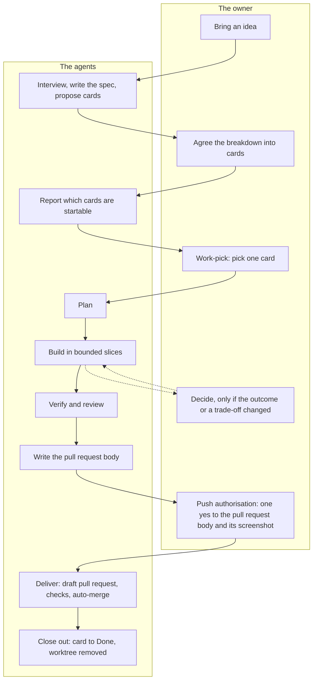

# The software factory

This repository is built by AI agents under a workflow the owner steers from two decisions: what to build, and
whether a finished change may ship. Everything between those two decisions is done by agents, checked by
tests and reviews the agents cannot skip, and recorded where the owner can read it without reading code.

These pages explain that workflow to someone who has never opened the repository: what the pieces are, how a change
moves through them, what is enforced by a machine and what is only instructed by a sentence, and which parts transfer to
another product. This page is the front page: it maps the whole, states the rules that hold everywhere, and routes each
question to the page that answers it. [`AGENTS.md`](../AGENTS.md) is the index every agent loads: the rules every
session needs in full and a pointer to the home of every other rule; the skills under
[`.agents/skills/`](../.agents/skills/) own the exact commands. The pages explain; they never restate a rule, a setting
or a command another document owns, and where a page and its owner disagree, the owner is right.

## The map

The owner reads pull request descriptions and screenshots, not diffs. The workflow therefore puts exactly two
decisions in front of the owner and phrases both in plain language.


```mermaid
flowchart TB
    subgraph Owner["The owner"]
        O1["Bring an idea"]
        O2["Agree the breakdown into cards"]
        O3["Work-pick: pick one card"]
        O4["Decide, only if the outcome or a trade-off changed"]
        O5["Push authorisation: one yes to the pull request body and its screenshot"]
    end
    subgraph Agents["The agents"]
        A1["Interview, write the spec, propose cards"]
        A2["Report which cards are startable"]
        A3["Plan"]
        A4["Build in bounded slices"]
        A5["Verify and review"]
        A6["Write the pull request body"]
        A7["Deliver: draft pull request, checks, auto-merge"]
        A8["Close out: card to Done, worktree removed"]
    end
    O1 --> A1
    A1 --> O2
    O2 --> A2
    A2 --> O3
    O3 --> A3
    A3 --> A4
    A4 --> A5
    A5 --> A6
    A6 --> O5
    O5 --> A7
    A7 --> A8
    A4 -.-> O4
    O4 -.-> A4
```

The diagram shows the owner's side beside the agents' side of one piece of work, from an idea to a merged change. Solid
arrows are the usual path; the dotted pair is taken only when the approved outcome or a trade-off changes during the
build.

In words: the owner brings an idea. The agents interview the owner, write the spec and propose cards, and the owner
agrees the breakdown into cards. The agents report which cards are startable and the owner picks one: that pick is
work-pick, the first of the two decisions. The agents then plan, build in bounded slices, verify and review, and write
the pull request body. The owner reads that body, with a screenshot where the change is visual, and says yes: that is
push authorisation, the second decision. The agents deliver and close out without asking again. Only if the approved
outcome or a trade-off changes during the build does a question go back to the owner in between. A change the
repository's own gate admits whole goes straight to `main` on the same yes, with no pull request.

The two decisions are named work-pick and push authorisation. [`AGENTS.md`](../AGENTS.md) owns what each approves, what
goes back to the owner in between, and the approval a destructive action still needs, under "Owner gates". Underneath
this path every job runs in its own worktree, every check logs its exit code, and a short list of machine guards holds
what a sentence could not; [The life of one change](AI-WORKFLOW-job.md) follows it stage by stage.

## Why it is shaped this way

An AI agent's characteristic failure is a plausible mistake, not a visible one: a result that is
self-consistent and wrong, a test that passes whatever the code does, a pull request description that
overstates what was verified. The workflow is built around three answers to that.

- **Slice by blast radius.** Work is cut by how many behaviours, sources of truth, and consumers a change can
  affect, not by file size. Each slice makes one verifiable claim, fits one build context, and declares the
  files it owns. A one-line change to a shared resolver is riskier than a long isolated document. Card size is settled
  before work-pick; [the `resume` skill](../.agents/skills/resume/SKILL.md) owns that rule, and the one split it allows
  afterwards, under "4. Plan".
- **Route capability by the judgment that remains.** After planning, ask what design choices are still open,
  how much is unknown, how bad a plausible defect would be, and how strongly tests can catch a weak
  implementation. A bounded builder takes work with no remaining judgment; remaining judgment is resolved in
  the plan or the slice is split, never absorbed by the session editing directly. Cost breaks ties only between
  equally reliable routes.
- **Treat evidence honestly.** A green check proves only what that check covers. A review with no comments is
  not a completed review. Missing evidence is reported as unavailable, never converted to a pass or a zero.

## The rules that hold everywhere

Eight things hold in every repository that carries the workflow, and they are what transfers to another product:

1. One contract file both runtimes read, with skills for the steps and hooks for what must never happen.
2. Two human gates, phrased for a reader of prose: what to build, and whether the finished change may ship.
3. One worktree per issue, and one draft pull request for every change that does not qualify for the direct route to
   `main`; a job's pull request is merged only by the platform's own auto-merge.
4. Seats with narrow charters, bounded handoffs through a template, and judgment settled in the plan rather than
   absorbed by the session.
5. One construction mode per claim, an executed mutation where [the testing strategy](TESTING-STRATEGY.md) requires one,
   and exit codes recorded by a script.
6. A fresh review of the final tree, its depth chosen by two questions asked of every change, whether it can be
   undone and how far the damage reaches if it is wrong; on the pull request route, an external review requested on
   the draft for the sign-off tier, then CI on ready.
7. A board, git, and documentation as three distinct stores, reconciled rather than assumed consistent.
8. Evidence limits as visible as evidence successes.

Product-specific protections are the surfaces the Surfaces table names; each product that adopts the workflow
fills that table with its own highest-consequence invariants and with its own answers to those two questions.

The workflow itself travels as the files `.agents/factory-manifest.json` lists. [`AGENTS.md`](../AGENTS.md) owns where
they are authored and when a sync card is opened, under "Shared workflow adoption";
[the `sync-job` skill](../.agents/skills/sync-job/SKILL.md) owns how they are fingerprinted, pinned and kept, what a
repository needs before it runs the workflow, how a sync job runs and which cards it covers; and
[the head of `scripts/factory-sync.mjs`](../scripts/factory-sync.mjs) owns its commands and exit codes.

Where the answer to a question lives, the board, git or a document, is set out in [`AGENTS.md`](../AGENTS.md) under
"Sources of truth".
A chat claim never overrides these. A claim that work shipped is checked against the commit and the checks;
a claim that work is next is checked against the board.

## Where to read what

| If you want to know | Read |
|---|---|
| What the owner decides, and when | [The map](#the-map) above, then [`AGENTS.md`](../AGENTS.md) under "Owner gates" |
| How Claude Code and Codex share one workflow, and what changes on Windows | [Two runtimes, one contract](AI-WORKFLOW-runtimes.md) |
| Who does what, and how work is handed from one agent to another | [The seats](AI-WORKFLOW-seats.md) |
| How a card becomes a merged commit | [The life of one change](AI-WORKFLOW-job.md) |
| How planned work is tracked, and how the board toolkit serves another board | [The board](AI-WORKFLOW-board.md) |
| What stops an agent from skipping a check, and what is only a sentence | [Enforced or instructed](AI-WORKFLOW-enforcement.md) |
| What counts as proof that a change works | [The evidence bar](AI-WORKFLOW-evidence.md) |
| What a pull request description holds, and what its review line means | [The review line](#the-review-line) below |
| How the workflow reaches another repository | [`AGENTS.md`](../AGENTS.md) under "Shared workflow adoption", then the [`sync-job`](../.agents/skills/sync-job/SKILL.md) skill |
| What is true of one repository alone: its product, own facts, grounding authorities and conventions | [`.agents/REPOSITORY.md`](../.agents/REPOSITORY.md) |
| What happens to a file, worktree or branch another job left behind | [Leftover rule](../.agents/skills/closeout/SKILL.md#leftover-rule) in the `closeout` skill; [`AGENTS.md`](../AGENTS.md) under "Owner gates" for the authority to delete one |
| The exact steps of a job | The [`resume`](../.agents/skills/resume/SKILL.md) and [`closeout`](../.agents/skills/closeout/SKILL.md) skills, and the [`greptile`](../.agents/skills/greptile/SKILL.md) skill for the external review of a sign-off tier change |
| Where every other document is | [`docs/README.md`](../docs/README.md) |

## The review line

Every pull request the `resume` skill delivers carries exactly one review line, so the review run before the pull
request opened is readable on GitHub. This section is the specification: any tool that writes or parses the line,
in this repository or another, follows it, and a tool that disagrees with it is the defect. The
documentation sweep and its day-after triage run no review before their pull requests open and carry no line.

```
Review: tier=sign-off rounds=7 raised=16 fixed=13 dismissed=2 deferred=1 greptile_rounds=2 greptile_raised=1 greptile_true=1
```

| Field | Value |
|---|---|
| `tier` | `document`, `code` or `sign-off`: the review tier the `resume` skill chose from the two questions: the session's own review, the cross-family review, or the cross-family review followed by Greptile. A change whose parts answer the two questions differently carries the tier of its heaviest part, and the one review covers the whole change at that tier. A pass run on the writing family's seat because the other family was unavailable keeps its tier; the pull request body declares the substitution |
| `rounds` | Reviewer passes over the tree, at least 1: the fresh review, each pass scoped to a repair, each `security-reviewer` pass, and each Greptile review of a commit count one each; a pass counts once it records its verdict, zero findings included |
| `raised` | Findings reported across every round, Greptile's included, a finding reported more than once counted once; in a self-review, the findings the session records in the Review section. A candidate the reviewer discarded itself is not one |
| `fixed` | Raised findings repaired in this pull request |
| `dismissed` | Raised findings judged false and dismissed with a reason |
| `deferred` | True findings not fixed here, each carried to a follow-up card or set aside by the owner because every fix costs more than it is worth, as the Review section names |
| `greptile_rounds` | Greptile reviews of a commit, a share of `rounds` and already counted in it |
| `greptile_raised` | Findings Greptile reported, a share of `raised` and already counted in it |
| `greptile_true` | Greptile findings fixed or deferred rather than dismissed as false, a share of `greptile_raised` |

The line is exactly the nine fields in this order, beginning at the start of a line with `Review: ` and ending
after the `greptile_true` value; trailing whitespace and a carriage return are ignored. Fields are separated by
single spaces, each written as the lowercase name, `=`, and a value with no spaces. Counts are whole numbers with
no leading zeros. Every finding is settled before merge, so `raised` equals `fixed` plus `dismissed` plus
`deferred`. `greptile_rounds` never exceeds `rounds`, `greptile_raised` never exceeds `raised`, `greptile_true`
never exceeds `greptile_raised`, `greptile_true` never exceeds `fixed` plus `deferred`, and `greptile_raised` minus
`greptile_true` never exceeds `dismissed`: Greptile's true findings are among the fixed or deferred ones and its
false findings among the dismissed ones. A pull request Greptile never reviewed, because its tier requests no
Greptile review or every attempt was `UNAVAILABLE`, carries `greptile_rounds=0` and therefore `greptile_raised=0`;
that reads as Greptile did not look, never as a clean Greptile review. Lines inside fenced code blocks or HTML
comments are not review lines, and a body carrying more than one valid line is invalid.

The line sits in the Review section of a body with five sections, which the session writes with the vendored `pr`
skill. Summary shows the change as a few plain sentences beside a small picture: a diagram, a tree or a diff
sketch. Evidence shows a before and an after, then the receipts a script wrote. Merge Danger carries the two
answers the tier was chosen from, each with its reason; for a change whose parts answer the two questions
differently they are the answers of the part that set the tier, named in each reason, with one sentence on what
the other parts take. Review carries the line, then the fresh reviewer's verdict, every finding with its
disposition, and one usage line for each reviewer pass the Usage view cannot show, as the `cross-review` skill
specifies; raw usage blocks stay out of the body. Not done names anything skipped, deferred or uncertain. The
skill carries a template of its own, and where it differs from `.github/pull_request_template.md` the
repository's template wins; [the `resume` skill](../.agents/skills/resume/SKILL.md) owns that rule under
"7. Push authorisation".
