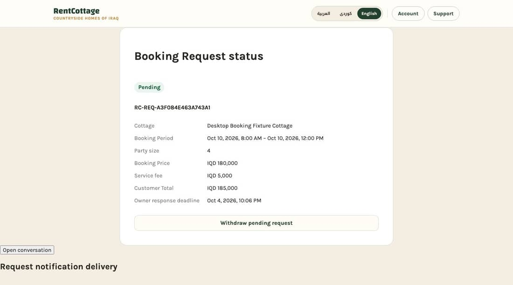
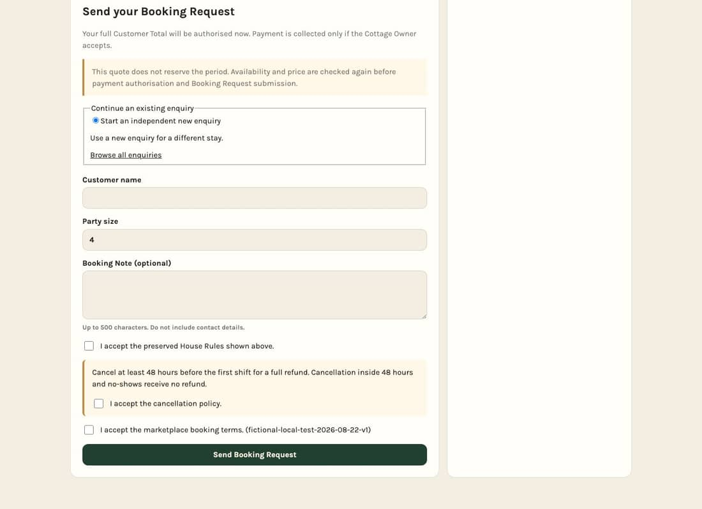
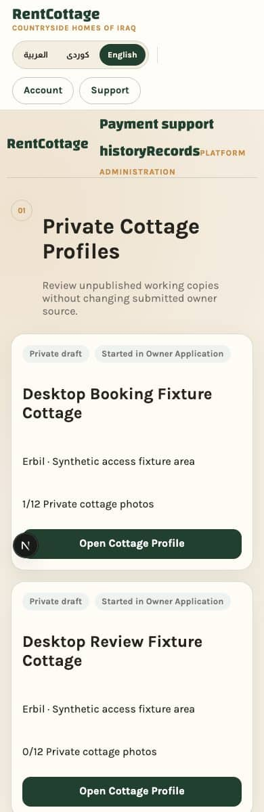
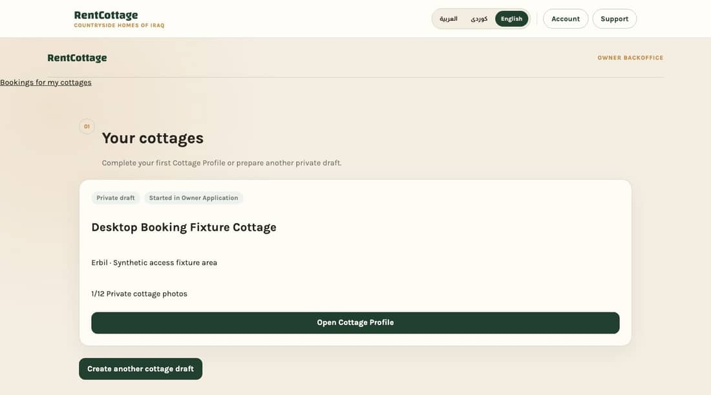
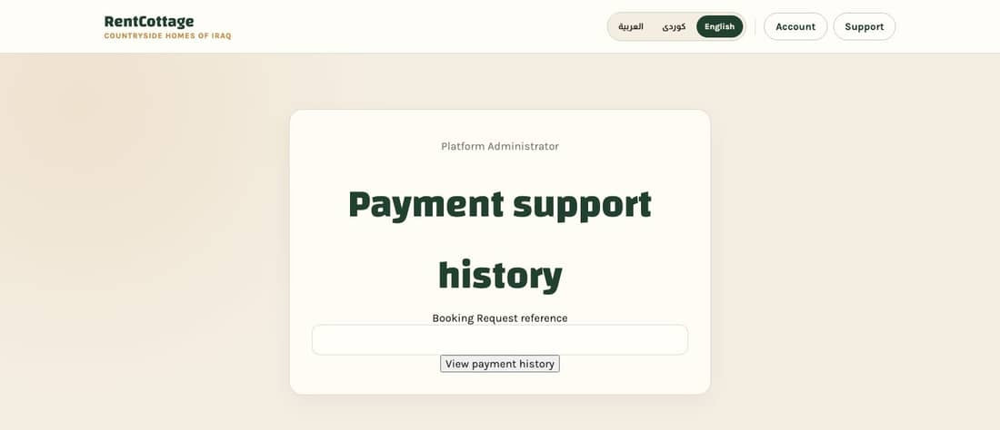
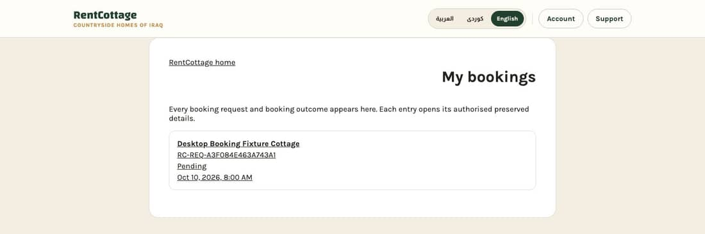
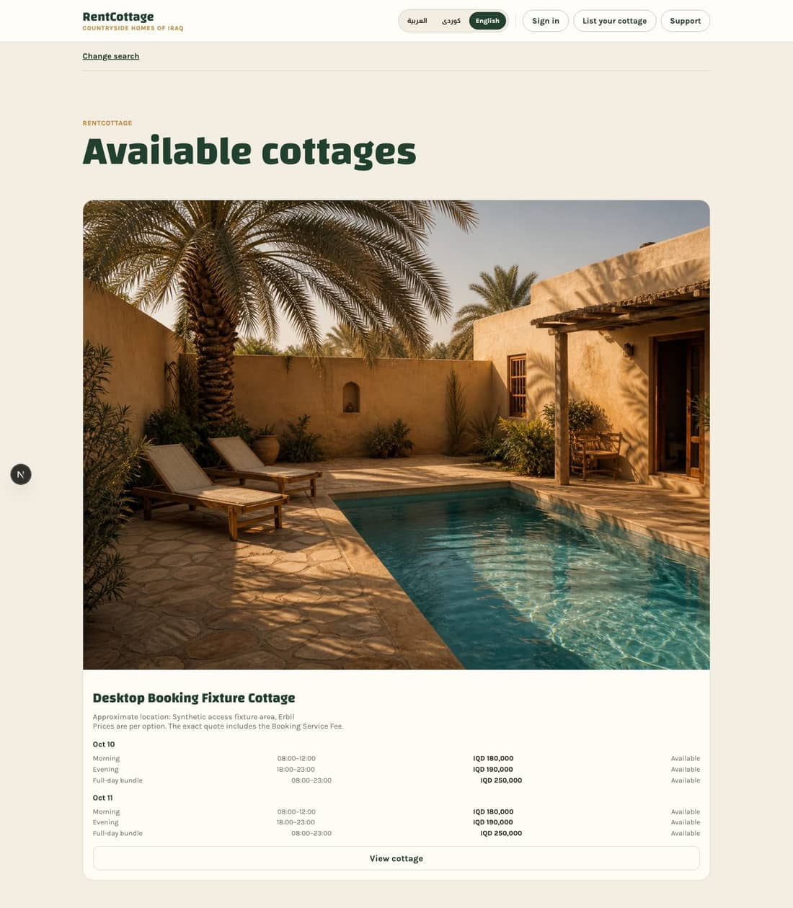
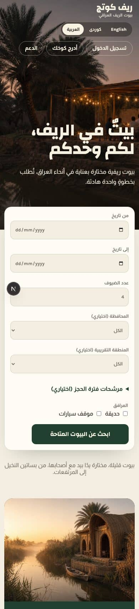
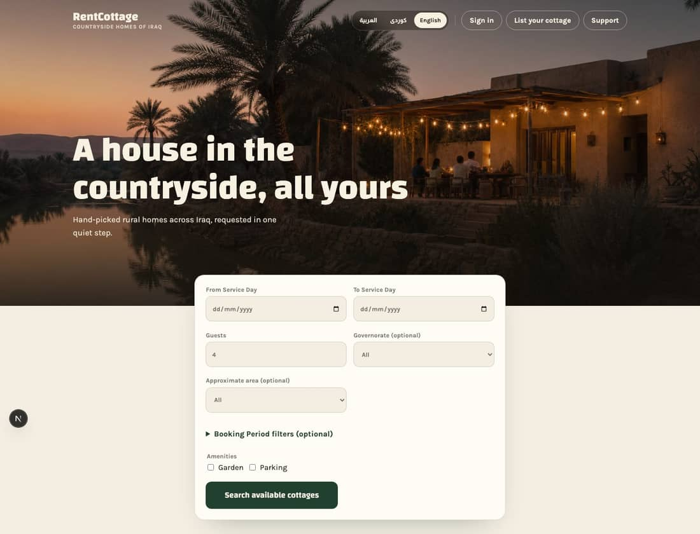

# Visual audit, 4 October 2026

Status: record of the product as it looked on 4 October 2026. Not maintained. The issues linked from each finding are
the living copy; parent issue [#231](https://github.com/zaingulel/RentCottage/issues/231).

Every screenshot shows synthetic test data only. The grey circle marked N in some screenshots is a developer tool, not
part of the product.

The brand is good and should stay. What is missing is everything between the brand and the screens, so each screen was
laid out by hand and they do not match. The home page is strong, and quality drops with every step deeper into the
product.

Based on about 110 full-page captures of the running product on desktop (1440 pixels wide) and phone (390 pixels wide),
in English, Arabic and Sorani, as a visitor, a Customer, a Cottage Owner and a Platform Administrator. Nothing in the
product was changed.

## Why it feels inconsistent, in numbers

The owner's view was that there is no design system. That is half true. There is a document and a set of colour and font
tokens, but nothing sets sizes or spacing, so every screen picked its own. Counting the distinct values in the style
sheets:

| Count | What |
|---|---|
| 36 | different text sizes |
| 38 | different padding values |
| 32 | different gap values |
| 16 | different corner radii |
| 10 | different shadows |
| 3 | page title styles |

A healthy product has roughly six to eight text sizes and one title style. Sizes such as 0.78 and 0.82 sit side by side
here, close enough that nobody chose the difference. Bold is also used for almost everything (54 of 61 weight settings),
so nothing stands out.

## Findings, worst first

### 1. Unstyled controls on the booking and payment pages (Broken)

Some buttons and headings have no styling at all and fall outside the page layout. On the request status page, "Open
conversation" is a raw grey browser button stuck to the window edge, with a heading beside it outside the card. The same
happens on the Cottage Owner's view of a request. This is the single biggest reason the product looks unfinished, and it
sits on the pages where a customer is about to pay.

*Customer request status. The card is fine; the two elements below it at the far left are unstyled. In Arabic they flip
to the far right edge the same way.*

*Request form. "Continue an existing enquiry" is a raw browser box with a default radio button. The price summary card
on the right stretches the full height of the page and is mostly empty
([#268](https://github.com/zaingulel/RentCottage/issues/268)).*

Owned by: [#553](https://github.com/zaingulel/RentCottage/issues/553).

### 2. Owner and administrator navigation falls apart (Broken)

The backoffice pages show a second "RentCottage" bar under the site header. On a phone its links run together into one
unreadable line. On desktop, "Bookings for my cottages" sits flush against the window edge, outside the page width.

*Administrator, phone. "Payment support historyRecords PLATFORM ADMINISTRATION" are three separate things rendered as
one.*

*Cottage Owner, desktop. Two brand bars, and a link at the far left outside the layout. The published cottage is also
labelled "Private draft" ([#269](https://github.com/zaingulel/RentCottage/issues/269) and
[#563](https://github.com/zaingulel/RentCottage/issues/563)), which reads as wrong even if it is technically a working
copy.*

Owned by: [#554](https://github.com/zaingulel/RentCottage/issues/554).

### 3. The "page not found" screen is the framework default (Broken)

A wrong link shows a blank white page with no header, no way back, and English only.

*What a customer sees after a mistyped or expired link.*

Owned by: [#555](https://github.com/zaingulel/RentCottage/issues/555).

### 4. Three different page title styles, and no page template (Inconsistent)

Titles come in three unrelated treatments: a huge green display heading (results, cottage page), a small display heading
(support), and plain black text (bookings, messages, request status, backoffice). Pages also disagree on width, on
whether the card touches the header, and on alignment.

*Administrator payment history. The title is so large it breaks onto two widely spaced lines, and the button under the
field is unstyled ([#553](https://github.com/zaingulel/RentCottage/issues/553)).*

*Customer bookings. The card is glued to the header, the title is on the right while everything else is on the left, and
every line of the booking is underlined, so nothing reads as the main thing.*

Owned by: [#559](https://github.com/zaingulel/RentCottage/issues/559).

### 5. Text has no formatting patterns (Inconsistent)

This is the "text looks terrible" problem the owner described. There is no agreed way to show a list of facts, a row in
a list, a status, a section heading or an empty state, so each page improvises. Details appear as long single-column
stacks, rows are fully underlined links, supporting text is tiny and grey, and empty states are one small centred line.

Owned by: [#562](https://github.com/zaingulel/RentCottage/issues/562).

### 6. Search results do not work as a list (Weak)

One cottage fills the whole screen with a photo about 850 pixels tall, so comparing cottages means a lot of scrolling.
The availability table below is in very small grey text with columns that do not line up, and the main action, "View
cottage", is styled as a secondary button.

*Results, desktop. This is a single result.*

Owned by: [#268](https://github.com/zaingulel/RentCottage/issues/268), with the direction chosen on
[#557](https://github.com/zaingulel/RentCottage/issues/557).

### 7. Customers are shown internal details (Weak)

The quote page shows "Content version 1", a long terms fingerprint code and a terms version number. The checkbox on the
request form reads "I accept the marketplace booking terms. (fictional-local-test-2026-08-22-v1)". These matter for the
record, but they should not be in front of a customer.

#556 removed these identifiers from the quote and request pages, and the acceptance sentence shown and recorded for new
requests is now `I accept the marketplace booking terms.`

Owned by: [#556](https://github.com/zaingulel/RentCottage/issues/556).

### 8. Long forms with no structure (Weak)

The Cottage Owner's profile editor is one page more than 5,200 pixels tall, with numbered headings on some sections and
not others, and buttons scattered on the right. The administrator's owner application review is similar, with plain
checkbox lists.

Owned by: [#269](https://github.com/zaingulel/RentCottage/issues/269) (Cottage Owner editor) and
[#563](https://github.com/zaingulel/RentCottage/issues/563) (administrator review).

### 9. Phone header and native form controls (Weak)

On a phone the header takes three rows before any content. Date fields, checkboxes and the filter toggle use the
browser's default look, which clashes with the styled fields around them.

*Home in Arabic, phone. The right-to-left layout itself is correct. The grey circle marked N is a developer tool, not
part of the product.*

Owned by: [#561](https://github.com/zaingulel/RentCottage/issues/561) (phone header) and
[#560](https://github.com/zaingulel/RentCottage/issues/560) (form controls).

## What works and should stay

*Home, desktop. This is the standard the rest of the product should reach.*

- The palette: cream, deep green and gold. It is warm, distinctive and suits the subject.
- The typefaces. The display face has character and its Arabic and Sorani forms are strong, which is rare.
- The site header, footer and language switcher on desktop.
- The primary and secondary buttons and the text field style.
- Right-to-left handling. No page overflowed sideways at either width in any language.

## Verdict on the existing design system

It is an accurate inventory of colours, fonts and buttons, and what it contains is sound. It is not yet a design system,
because it says nothing about sizes, spacing, page structure or how content is laid out. The recommendation is to keep
it and extend it, not replace it.

| Verdict | Part | Why | Owned by |
|---|---|---|---|
| Keep | Colour and font tokens, shared buttons and field, focus and accessibility rules, right-to-left rules | Well chosen and already used consistently where they are used. | No change |
| Tidy | Near-duplicate colours; corner radius and shadow values | Already recorded as known debt ([#442](https://github.com/zaingulel/RentCottage/issues/442) and [#435](https://github.com/zaingulel/RentCottage/issues/435)). Reduce each to a short named scale. | [#442](https://github.com/zaingulel/RentCottage/issues/442) and [#435](https://github.com/zaingulel/RentCottage/issues/435) |
| Missing | Text size scale and spacing scale | The direct cause of the 36 text sizes and 38 paddings. | [#449](https://github.com/zaingulel/RentCottage/issues/449) |
| Missing | One page template: width, gap under the header, title style, backoffice navigation | The cause of findings 2 and 4. | [#559](https://github.com/zaingulel/RentCottage/issues/559) and [#554](https://github.com/zaingulel/RentCottage/issues/554) |
| Missing | Content patterns: fact list, list row, status badge, section heading, empty state, summary card | The cause of finding 5. | [#562](https://github.com/zaingulel/RentCottage/issues/562) |
| Missing | Styled checkbox, radio, date field, grouped options and a phone header | The cause of findings 1 and 9. | [#560](https://github.com/zaingulel/RentCottage/issues/560) and [#561](https://github.com/zaingulel/RentCottage/issues/561) |

## What the audit did not see

- These screens were captured only in their empty state, because filling them needs a paid, confirmed booking and the
  test setup could not produce one in this pass: conversations, reviews, payment history and populated administrator
  records. More findings are expected there.
- The Customer journey was captured on desktop only. Its phone captures failed and were not retaken.
- The test cottage's shift names stayed in English on Arabic pages. That is test data, not a design fault.

Owned by: [#558](https://github.com/zaingulel/RentCottage/issues/558).

## Proposed next steps

1. **Repair the broken items now.** Findings 1 to 3 need no design decisions, only the existing button and layout styles
   applied. One small job, and the product stops looking unfinished. Issues:
   [#553](https://github.com/zaingulel/RentCottage/issues/553),
   [#554](https://github.com/zaingulel/RentCottage/issues/554),
   [#555](https://github.com/zaingulel/RentCottage/issues/555) (and
   [#556](https://github.com/zaingulel/RentCottage/issues/556)).
2. **Agree a direction on three screens.** Mock up search results, the cottage page with its booking panel, and the
   request status page, in two directions that both keep the current brand, and let the owner pick one. This is where
   taste matters most, and it is far cheaper to change a mock-up than a built screen. Issue:
   [#557](https://github.com/zaingulel/RentCottage/issues/557).
3. **Write the foundations.** Turn the chosen direction into the missing parts of the design system: the size and
   spacing scales, the page template and the content patterns, added to the existing document and tokens. Issues:
   [#449](https://github.com/zaingulel/RentCottage/issues/449),
   [#559](https://github.com/zaingulel/RentCottage/issues/559),
   [#562](https://github.com/zaingulel/RentCottage/issues/562),
   [#560](https://github.com/zaingulel/RentCottage/issues/560).
4. **Roll out in small jobs.** Customer journey first, then Cottage Owner, then Platform Administrator. Each job is one
   or two screens with before and after screenshots for approval. Issues:
   [#268](https://github.com/zaingulel/RentCottage/issues/268),
   [#269](https://github.com/zaingulel/RentCottage/issues/269),
   [#563](https://github.com/zaingulel/RentCottage/issues/563).

Steps 1 and 2 do not depend on each other and can run side by side.
