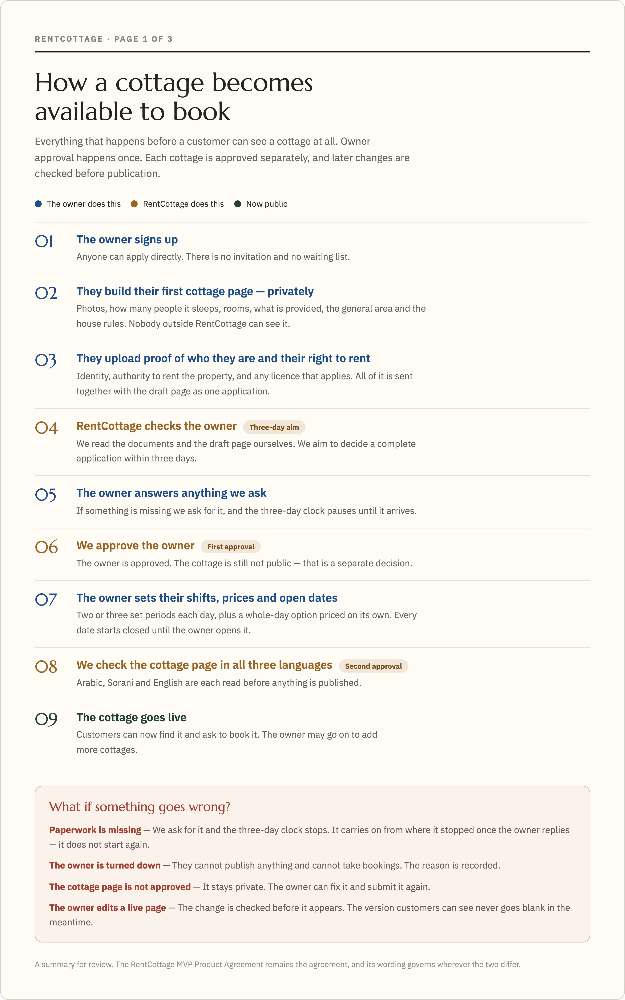
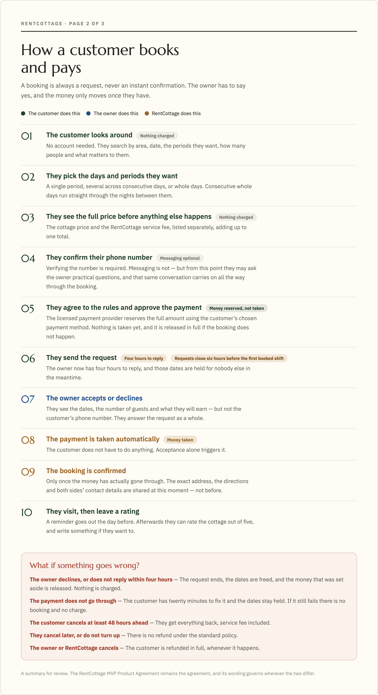
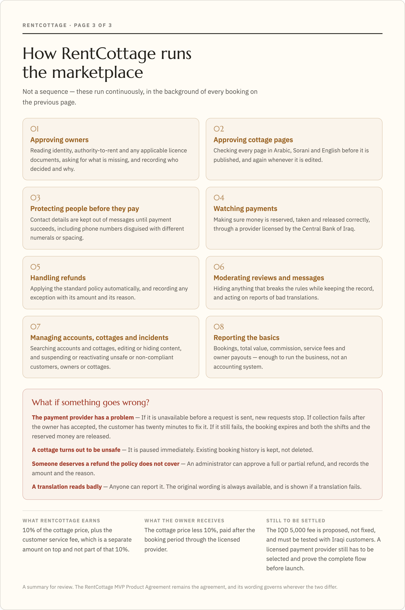

# RentCottage MVP Product Agreement

**Status:** Proposed for client sign-off
**Updated:** 2 August 2026
**Client approver:** Yasir Kurkdji
**Delivery lead:** Zain El-Abidin Abo Gulel

## 1. What we are agreeing to build

RentCottage will be a mobile-friendly marketplace where customers can discover and request whole private cottages and chalets across Iraq.

Cottage owners can apply directly by creating a private first cottage page and uploading their evidence. RentCottage checks and approves each owner and cottage before it becomes public.

The first release is a web application in Arabic, Sorani Kurdish and English. It supports the Iraqi norm of booking a day as two or three fixed shifts, several shifts together, or a full-day option.

## 2. The service at a glance

| Area | Agreed MVP |
|---|---|
| Coverage | Approved cottages anywhere in Iraq |
| Languages | Arabic, Sorani Kurdish and English |
| Customer access | Browse without an account; verify a phone number before first messaging or requesting |
| Owner access | Apply directly with a private first cottage page and evidence, then wait for approval |
| Booking | Request to book; the owner accepts or declines |
| Payment | Customer authorises the full total before requesting; payment is collected automatically after owner acceptance |
| Cottage schedule | Two or three fixed shifts per day, multiple shifts, or a separately priced full day |
| Customer fee | Proposed fixed IQD 5,000 booking service fee, shown separately and validated before launch |
| Owner commission | 10% of the cottage booking price |
| Cancellation policy | One policy for all cottages |
| Communication | In-platform text messaging, with contact protection before payment |
| Trust | Owner checks, reviews from completed bookings, and platform moderation |

## 3. Main journeys

These visual summaries show the owner, customer and RentCottage journeys in plain language. The capability and rule sections that follow remain the precise agreement.

## 4. Agreed customer and owner capabilities

Each capability combines the user need with the acceptance checks for this agreement. The build may be delivered in smaller stages without changing the agreed outcome.

### A. Discover and understand a cottage

| User story | Agreed acceptance |
|---|---|
| **As a customer** **I want** to browse approved cottages in my language **So that** I can find a suitable place anywhere in Iraq | Customers can browse without an account. Search supports area, date, shifts, guest count and key amenities. Cottage pages show photos, capacity, amenities, house rules, approximate location, available shifts and prices. Arabic and Sorani display right to left; English displays left to right. Changing language does not lose the current page or selections. |

### B. Apply as a cottage owner

| User story | Agreed acceptance |
|---|---|
| **As a cottage owner** **I want** to apply directly and create my cottage page **So that** I can join without waiting for an invitation | An owner can create an account, prepare a private first cottage page, upload identity, authority-to-rent and applicable licence evidence, and submit everything together. RentCottage can request missing information, approve or reject the owner, and record who decided and why. Documents and the draft page remain private and limited to authorised staff. The cottage cannot become public or receive requests until both owner and cottage approvals are complete. |

### C. Publish trusted cottage information

| User story | Agreed acceptance |
|---|---|
| **As a cottage owner** **I want** to publish accurate cottage information in all launch languages **So that** customers can book with confidence | The first private cottage page starts during the owner application; approved owners may create more. Each cottage requires photos, capacity, rooms, amenities, approximate location and house rules. The owner may enter text in Arabic, Sorani or English. The system creates draft translations, preserves the original and lets RentCottage approve all language versions before publication. Later content changes are reviewed while the last approved version remains public. |

### D. Set shifts, prices and availability

| User story | Agreed acceptance |
|---|---|
| **As a cottage owner** **I want** to control my shifts, prices and future availability **So that** RentCottage reflects how my cottage operates | Each cottage has two or three fixed daily shifts. A shift may cross midnight and belongs to the date it starts. The owner can price each shift and a full-day option differently, with weekday and specific-date prices. New cottages start closed. The owner opens future shifts or blocks them for private use. Changes never rewrite submitted requests or confirmed bookings. |

### E. Request a booking and secure payment

| User story | Agreed acceptance |
|---|---|
| **As a customer** **I want** to request available shifts and know payment is secure **So that** the cottage is confirmed only when the owner accepts and payment succeeds | The customer can select one or more shifts across consecutive days, including a separately priced full-day option on each day. Consecutive full-day selections provide continuous access between days. The price shows the cottage booking price, fixed RentCottage service fee and customer total. The customer enters party size, accepts the rules and authorises the full total before sending the request. The request holds every selected shift and gives the owner four hours to accept or decline. Payment is collected automatically after acceptance. Declined, withdrawn or expired requests release the authorisation. No cash or unpaid fallback is included. |

### F. Confirm and coordinate a paid booking

| User story | Agreed acceptance |
|---|---|
| **As a customer or cottage owner** **I want** a clear paid confirmation and a safe way to coordinate **So that** both sides know the booking is real and can prepare | Confirmation appears only after successful payment and includes a unique reference. The exact address, directions and mutual contact details are released after payment. Both sides receive status notifications and a reminder 24 hours before the first shift. Booking history shows pending, confirmed and past outcomes. |

### G. Message without bypassing RentCottage

| User story | Agreed acceptance |
|---|---|
| **As a customer or cottage owner** **I want** to message inside RentCottage **So that** I can ask practical questions safely | After phone verification, a customer can start a text conversation from a cottage page before requesting and continue it through the request and booking. Before payment, the system blocks phone numbers, email addresses, web links and social handles, including common disguised number formats; repeated bypass attempts can be reviewed by RentCottage. After payment, contact details may be shared. Messages can be translated, while the original remains viewable. A booking conversation becomes read-only seven days after the booking ends. Audio and video calls are not included. |

### H. Cancel and receive the correct outcome

| User story | Agreed acceptance |
|---|---|
| **As a customer** **I want** one clear cancellation policy **So that** I understand the outcome before I pay | Cancelling at least 48 hours before the first booked shift automatically returns the full customer total, including the service fee. Cancelling inside 48 hours, or not attending, receives no refund under the standard policy. If the owner or RentCottage cancels, the customer automatically receives the full total. An administrator can approve a recorded full or partial refund exception. The policy is shown before payment and uses Iraq time. |

### I. Leave and manage genuine reviews

| User story | Agreed acceptance |
|---|---|
| **As a customer** **I want** to review a cottage I used **So that** future customers have useful evidence | A customer can leave one rating from one to five stars, with an optional written review, within 14 days of a completed paid booking. The owner may post one public reply. Neither reviews nor replies may contain contact details or external links. Reviews and replies can be translated with the original available. RentCottage can hide content that breaches the rules while retaining the internal record. |

### J. See earnings and operate the marketplace

| User story | Agreed acceptance |
|---|---|
| **As a cottage owner or RentCottage administrator** **I want** basic financial and operational information **So that** I can understand bookings and take action | Owners see the booking price, 10% commission, refund outcome and expected or paid payout per booking, plus simple totals. Administrators can search customer and owner accounts and cottage pages; edit or hide cottage content; suspend or reactivate accounts and cottages; and see applications, approval queues, bookings, payment and refund states, incidents, reviews, and simple totals for bookings, gross value, commission, service fees and owner payouts. Data can be exported for operational follow-up. |

## 5. Booking and payment rules

| Rule | Agreed behaviour |
|---|---|
| Booking method | Request to book, not instant booking |
| Owner response | Four hours; unanswered requests expire |
| Last request time | Six hours before the first selected shift |
| Payment before request | Authorise and reserve the full Customer Total |
| Payment after acceptance | Collect automatically; confirmation waits for success |
| Failed collection | Keep the shifts held for a 20-minute recovery period, then expire if unpaid |
| Double-booking protection | A pending or confirmed booking blocks every overlapping component shift |
| Customer overlap | A customer cannot hold overlapping active requests at different cottages |
| Customer fee | Proposed IQD 5,000 fixed service fee, shown separately and included in a full refund |
| Owner commission | 10% of the Booking Price, shown to the owner before acceptance |
| Payout | Eligible after the booking period, subject to the licensed provider's agreed settlement process |
| Payment provider | Must be licensed by the Central Bank of Iraq and prove the complete flow before launch |

RentCottage will not run its own customer wallet or directly improvise custody of customer funds. Qi Card is the first provider to investigate, but this agreement does not select a provider.

## 6. Privacy, safety and moderation

- Browsing shows only an approximate location. Exact directions and direct contact information appear after payment.
- Owner identity, ownership and licence documents are private, access-controlled and never used for automatic translation.
- Automatically translated content is labelled, the original remains available and is shown if translation fails, and users can report a poor or inappropriate translation.
- RentCottage records important administrator actions and access to verification documents.
- Owners can block future availability but cannot edit or reschedule a submitted request or confirmed booking.
- RentCottage can pause an unsafe or non-compliant cottage without deleting booking history.
- Support complaints, payment disputes and public reviews remain separate records.
- A legal adviser must approve the owner-document checklist and retention periods before public launch.

## 7. Whole-product acceptance

The MVP is ready for public launch only when:

- customers can complete the agreed journey on a mobile-sized screen in Arabic, Sorani and English;
- at least ten real cottages are approved and ready, preferably across at least two demand areas;
- booking conflicts and payment outcomes have been proven under competing requests and repeated provider events;
- a licensed payment provider has demonstrated authorisation, later collection, release, full refunds, disputes and lawful owner settlement;
- owner documents are protected and the legal checklist and retention schedule are approved;
- notifications, messaging controls, automatic translation and review moderation work as described;
- the fixed customer fee and online-payment willingness have been tested with prospective Iraqi customers;
- the cancellation, refund, support and owner terms are approved for launch.

## 8. Not included in this MVP

| Not included | What this means |
|---|---|
| Native iPhone or Android apps | The launch product is a mobile-friendly website. Native apps may follow later. |
| Instant booking | Every booking remains a request that the owner accepts or declines. |
| Cash, bank-transfer or pay-on-arrival booking | The first release is online-payment only. |
| Customer wallet or RentCottage-held balance | Money is handled through a licensed provider, not stored as RentCottage customer credit. |
| Rescheduling or direct booking edits | A customer cancels and submits a new request. Owners can only change future availability. |
| Partial acceptance | An owner accepts or declines the customer's complete request. |
| Partial refunds under the standard cancellation policy | The standard policy is a full refund at least 48 hours before the first shift, otherwise no refund. An administrator may still approve and record a full or partial exception. |
| Damage deposits | No separate refundable damage deposit is collected in the MVP. |
| Automatic discounts, loyalty or promotional pricing | Owners set shift, full-day, weekday and specific-date prices. Other discount systems may follow later. |
| Audio or video calling | MVP communication is text messaging plus direct contact after payment. |
| Advanced staff permissions | MVP uses secure administrator access and audit records, not a complex staff-role system. |
| Full accounting, finance or revenue-management suite | MVP provides basic totals, booking-level money views and export. It does not replace accounting software or optimise prices. |
| Owner analytics and forecasting | Owners receive simple earnings and booking history, not demand forecasts or performance dashboards. |
| Hotels, rooms or shared accommodation | RentCottage books a whole private cottage or chalet for one customer group. |

## 9. Assumptions and decisions still required

These are launch gates, not missing product decisions:

- Confirm the legal operating entity and obtain Iraqi legal, tax, tourism, privacy and insurance advice.
- Validate the proposed IQD 5,000 customer service fee with prospective customers.
- Contract a licensed provider after sandbox and commercial validation. Qi Card is the first candidate; ZainCash and AsiaPay are alternatives.
- Confirm the owner document checklist and retention schedule for federal Iraq and the Kurdistan Region.
- Select and quality-test the automatic translation service for Arabic and Sorani.
- Confirm phone verification, urgent notification and map suppliers.

## 10. Sign-off

By signing or providing written approval, the client confirms that this document clearly describes the RentCottage MVP to be built. The work may be completed in smaller stages, but every stage must preserve these outcomes and exclusions.

**Approved by:** ______________________________________
**Role:** _____________________________________________
**Date:** _____________________________________________
**Signature or written approval reference:** ________________________________

### Sign-off checklist

- [ ] The product, users and nationwide scope are correct.
- [ ] The shift and request-to-book journeys are correct.
- [ ] The customer service fee, owner commission and payment flow are correct.
- [ ] The cancellation and refund rules are correct.
- [ ] Owner applications, checks and document handling are correct.
- [ ] Messaging, contact protection, reviews and translation are correct.
- [ ] The basic administrator and owner tools are sufficient for the MVP.
- [ ] The exclusions and remaining launch gates are understood.
- [ ] This Product Agreement is approved for MVP delivery planning.
