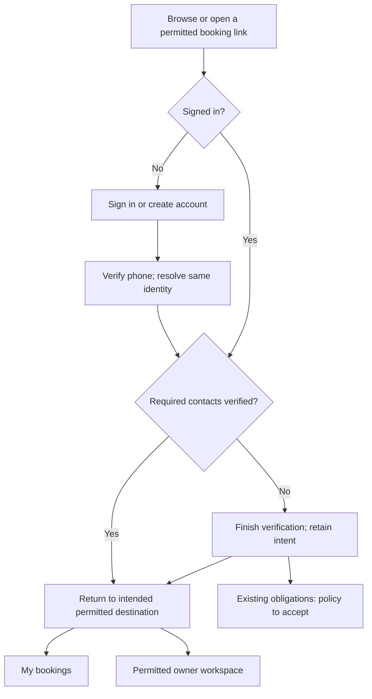

# Account access: design for owner review

Status: owner accepted the MVP account design and authorized implementation planning. Visual refinement and representative-user/native-language validation are deferred. The fixed security and migration plan is still required before construction.
Issue: [#214](https://github.com/zaingulel/RentCottage/issues/214). Related: [#222](https://github.com/zaingulel/RentCottage/issues/222), [#216](https://github.com/zaingulel/RentCottage/issues/216). Inspected base: `4fe47f4bc2ec9dfff15f81dfa65bbf9c0ed39ee9`. Research date: 10 September 2026.

The owner selected research/design, reviewed the proposed screens, then accepted the MVP approach and asked to proceed with functionality first. No representative-user sessions have been arranged or performed. This document does not complete #214, select suppliers, or claim measured usability improvement. Implementation remains bounded by the fixed plan and #214 acceptance criteria.

## Recommendation

Use one visible **Sign in** entry and one account identity. After signing in, **Account** offers **My bookings**, **Manage my cottages** when applicable, and **Sign out**. Owner enrollment remains a distinct **List your cottage** journey. The current page should say whether the person is viewing their customer bookings or owner workspace. Switching workspace never changes permissions.

Keep phone-code sign-in as the starting proposal; adding mandatory verified email under #222 does not itself mean asking for two codes on every return. Establishing verified contacts, authenticating a session, and authorizing an operation are separate decisions. The exact returning-session and contact-change policy remains for the joint implementation plan. The new-account screen must explicitly explain account creation; do not silently promise that a code request only signs in when it can also initiate enrollment.

The owner's direction already settles one account with both capabilities. The remaining decisions concern safe migration, verification enforcement, restrictions, and interface terminology—not whether owners should need a second account.

## Evidence and alternatives

| Evidence | Finding | Application and limitation |
| --- | --- | --- |
| [Airbnb account switching](https://www.airbnb.com/help/article/3546) | Documents hosting and travelling within one account. | Supports separating identity from workspace; not proof of suitability for Iraqi customers. |
| Direct public Airbnb observation | UK site navigation opened a combined login/enrollment dialog; its initial field accepted phone or email. | Observed on desktop and at 390×844 viewport. No credentials entered or authenticated journey inspected. We need not adopt its additional login methods. |
| [Vrbo account guidance](https://help.vrbo.com/articles/Travelers-Access-your-account) and direct UK homepage observation | Public navigation exposed trips and a sign-in menu with an owner destination. | Explicit role destinations can be discoverable, but separate role sign-in would conflict with the selected RentCottage outcome. Narrow-viewport DOM inspected, not a native mobile app. |
| [Booking.com sign-in](https://www.booking.com/signin.html) and direct observation | Guest access and account creation were distinguished from partner Extranet access. | Supports clear task destinations and separate administration. Does not demonstrate shared guest/owner identity. Desktop and narrow viewport inspected; no account flow submitted. |
| [Airbnb reservation guidance](https://www.airbnb.com/help/article/2064) | Reservation access belongs to the booking account. | Our private links still require authenticated participant authorization. |
| [GOV.UK account creation](https://design-system.service.gov.uk/patterns/create-accounts/) | Make enrollment clear and let people use the service before requiring an account. | Browse/search remains public. Government wording is not a universal marketplace vocabulary rule. |
| [Accessible authentication](https://www.w3.org/WAI/WCAG22/Understanding/accessible-authentication-minimum.html) | Support paste/autofill instead of requiring code transcription. | One code input; no forced six-box interaction. A working input is not complete accessibility certification. |
| [Phone input guidance](https://design-system.service.gov.uk/patterns/phone-numbers/) | Permit familiar formatting; explain purpose and international prefixes. | Normalize safely on the server, preserve editable input. The guidance itself notes gaps in international-number research. |
| [Phone confirmation guidance](https://design-system.service.gov.uk/patterns/confirm-a-phone-number/) | Show an explicit code step and help when a message does not arrive. | Use actual supplier expiry/resend policy, not the example's timings. |
| [Form notifications](https://www.w3.org/WAI/tutorials/forms/notifications/) and [target sizes](https://www.w3.org/WAI/WCAG22/Understanding/target-size-minimum.html) | Associate understandable errors with controls and provide usable targets. | Propose 44-pixel controls, visible focus and status announcements; validate production behavior separately. |

Observations were signed out, UK-localized, through the Codex browser. Region, experiments and viewport may change the presentation. Narrow desktop viewport evidence is not physical-phone, assistive-technology, Arabic or Sorani validation. No bookings, accounts or external messages were created. Browser tabs were closed and the temporary viewport override reset.

| Option | Benefit | Cost / decision |
| --- | --- | --- |
| One account menu with direct destinations — recommended | Bookings and owner tools are visible without making people choose a role before login. | Requires capability-aware database authorization, not just a header change. |
| Mandatory “Customer / Owner” choice after every login | Makes workspace explicit. | Adds a repeated decision; loses direct-link intent unless carefully handled. Use a workspace heading, not a mandatory interstitial. |
| Separate customer and owner sign-in | Familiar on some competitors. | Conflicts with the selected one-account experience; retains accidental wrong-role failures. |

Provisional English labels are **Sign in**, **Create an account**, **My bookings**, **Manage my cottages**. Compare “Sign in”/“Log in” and “My bookings”/“Trips” in local-language task trials. Cottage shifts are not necessarily overnight trips. This is a domain-fit inference, not evidence that one English label converts better.

## Current and proposed journeys

Current: homepage → Owner sign-in or Booking History. Customer verification is embedded in a booking quote/request. History currently reads paid confirmations; failure renders a generic unavailable state. A role conflict signs the identity out. Evidence: `src/components/marketplace-shell.tsx`, `src/components/phone-access-form.tsx`, `src/access/account-access.ts`, `src/app/[locale]/bookings/page.tsx`.

Proposed:

The existing-obligation exception is a proposal requiring an explicit security plan; it must not be implemented as a blanket verification bypass.

| Person / entry | Proposed behavior |
| --- | --- |
| First-time customer | Browse first. At sign-in or request, explain enrollment; verify required contacts before transacting, then return to the quote. Revalidate availability and price before submission. |
| Returning customer | Same verified identity, no customer/owner guessing. Open own bookings; show confirmed-only coverage honestly until #37 delivers the complete list. |
| Prospective owner | List your cottage → same sign-in → enrollment/application or application status. Approval remains separate. |
| Approved owner | Account → Manage my cottages. My bookings continues to show that person's customer activity. |
| Owner booking elsewhere | Browse and request as the customer participant using the same user identifier. Changing workspace grants no extra access. |
| Private link while signed out / expired | Authenticate and return to the same allowed local destination and language. Recheck participant permission before displaying details. |
| Wrong account | Generic denial without disclosing the other account or booking; offer Sign out and try another account. Do not automatically link identities. |
| Shared device / sign-out | Clear private navigation and cached private content; back navigation must not recover private server data. Do not retain a contact or last workspace across accounts as authority. |
| Interrupted verification | Resume from server-confirmed progress; don't lose the intended request. A failed send is not “code delivered”; late responses must not duplicate submission. |

## Phone, email and language coordination

#216 owns accepted country coverage, normalization and international delivery evidence. #214 can use a proposed country/dialling-code control without claiming worldwide delivery. Compare this control with one international-number field in #216's research. Preserve pasted complete numbers, avoid duplicated country codes, make national-prefix correction explicit, and evaluate Western, Arabic and Persian digits. Do not infer residence or owner eligibility from the country picker.

[Supabase phone sign-in](https://supabase.com/docs/guides/auth/phone-login) requires provider configuration. Its documented defaults are not proof of the application's configured expiry/resend behavior. [Twilio country guidance](https://www.twilio.com/en-us/guidelines/sms) also treats delivery requirements by destination. Neither establishes RentCottage's Iraqi carrier coverage, prices, delivery latency or sender approval. No provider selected or live delivery tested here. #47 retains Iraqi supplier work; #216/#222 must name their accepted activation owners before closing software-only work. WhatsApp remains #223's optional phone channel, not a replacement for required email.

For email, attach verification to the authenticated identity rather than starting an independent email account. Email changes, collisions, expired/used tokens and recovery need #222's explicit plan. Do not reveal whether a contact is registered before verification. Loss of the old phone must offer an honest recovery/support state; this proposal does not authorize staff to bypass ownership proof.

Arabic and Sorani require right-to-left page flow, with isolated left-to-right phone/code/email runs; see [W3C bidirectional guidance](https://www.w3.org/International/questions/qa-bidi-unicode-controls). Preserve language through links, verification and errors. Native-language labels, screen-reader pronunciation and mixed-direction punctuation remain unvalidated. Existing translations are source material, not proof that new wording is suitable.

## States the design must cover

- Signed out: visible sign-in plus browsing and owner enrollment.
- Phone step: country code, editable number, purpose and clear account-creation explanation.
- Code step: a single pasteable/autofill field; masked destination, edit number and resend eligibility.
- Verification incomplete: show verified phone and remaining email task; keep existing obligations recoverable under accepted policy.
- Signed in: own bookings, appropriate owner destination, sign out.
- Wrong/expired code: preserve number, explain the correction or resend action without invented timings.
- Send failure / rate limit: distinguish failure from success; offer retry at the server-supplied eligibility point.
- Empty: “No confirmed bookings yet” rather than pretending all requests have been searched.
- Technical failure: “We couldn't load your bookings. Try again.” Never replace it with an empty result.
- Session expired: explain sign-in is needed and preserve intended destination.
- Owner approval restricted: explain owner restriction separately from customer access, subject to the decision below.

## Decisions for the owner review

1. Accept the direct account menu and plain-language destination proposal, subject to native-language validation.
2. Proposed suspension policy: an owner-specific restriction does not automatically remove customer access; platform-wide safety suspension can affect both. Existing owner obligations need an explicitly authorized limited-access policy. Current behavior must not be silently broadened.
3. Proposed self-booking policy: an owner cannot request their own cottage; use private blocks for personal use. Booking another owner's cottage is allowed. Dual capability otherwise opens a currently incidental restriction and a duplicate-recipient notification case.
4. Proposed verification policy: both verified contacts required before new booking requests and owner transactions; returning users complete only missing verification, not automatically two challenges every visit. Settle safe access to ongoing obligations and contact-change proof in #222.

The owner accepted the MVP proposal and asked to proceed. For #214, implement the direct menu, inherited customer capability, explicit self-booking denial and current-device sign-out. Preserve current denial of suspended/expired owners’ private owner-confirmation access; do not implement the proposed broader obligation exception or platform-wide suspension machinery. #222 retains exact email/phone enforcement and recovery decisions.

## Trial tasks prepared for owner review

Use fictional accounts and bookings. Give the task, not button names or instructions. Capture first action, wrong turns, completion without help, explanation in the participant's own words and any moderator help. Do not invent scores, timings or participant results.

| Task | What to learn |
| --- | --- |
| You booked last week; find your booking from the homepage. | Can a returning customer discover account access? |
| This is your first visit; arrange access so you can request a cottage. | Is account creation clear? |
| You own a cottage but want to book another for your family. | Does one identity with two destinations make sense? |
| Return to managing your own cottage. | Can owners find their tools without signing in again? |
| Your code did not arrive / expired. | Can someone recover without restarting or guessing? |
| Open a booking link after your session expires. | Does sign-in return to the expected record? |
| You are using a shared phone; finish and leave safely. | Is sign-out discoverable and its effect understood? |
| Paste a supported international number, then correct its country. | Can the #216 proposal avoid prefix mistakes? |

Start with the owner's walkthrough as requested. Later recruit representative customers and owners across English, Arabic and Sorani, including mobile users and someone who both books and owns. Select participants with consent; do not collect real verification codes or private booking details. Owner review and agent inspection are not substitutes for those trials.

## Completion limits

At completion of the research phase, no product code or database had changed. The owner then accepted the MVP approach and authorized implementation, with visual refinement and representative/native-language validation deferred. Country/provider decisions remain owned by related tickets. Research alone does not close #214; executable evidence and independent review must establish implementation completion. Findings remain local pending an approved publication packet; no issue or Project mutation has been performed.

## Architecture findings for the next plan

Read-only architect inspection confirms `account_contexts` has one row per `auth.users.id` with exclusive role and owner-approval constraints (`supabase/schemas/10_tables_platform.sql`). `claim_marketplace_role` rejects a different role. Customer admission predicates recur in `src/booking-request/actions.ts` and `supabase/schemas/20_functions_booking.sql`; paid-history and private-detail functions also compare the account role to immutable receipt participant roles. This is a database authorization migration.

Recommended smallest adequate model: retain the durable user identifier and account classification, give both customer and owner marketplace classifications customer capability, and make owner enrollment a separate locked, idempotent transition to prospective owner. Do not add a generic membership framework for two selected workspaces. Participant authorization must come from the specific booking/receipt, not a client-selected workspace. Do not rewrite historic receipt roles, payment records or booking participants.

Current tests deliberately deny suspended owners private confirmed-booking facts. A limited existing-obligation access policy would change that security contract and must be separately accepted. There is no inspected independent account-wide suspension field; mentioning that future policy does not authorize building #44's general suspension system in #214. If it is a required prerequisite, scope and link the exact dependency first.

The accepted self-booking restriction addresses this finding: the current exclusive roles prevent it incidentally, and status-notification uniqueness on booking/recipient/status conflicts when both participants are the same user (`supabase/schemas/30_constraints.sql`). Implement an explicit database admission denial plus the private-block route. This guard was not present at the inspected baseline.

[Supabase updateUser](https://supabase.com/docs/reference/javascript/auth-updateuser) supports updating contacts on the authenticated user; [identity linking](https://supabase.com/docs/guides/auth/auth-identity-linking) is not proof of a safe arbitrary merger of existing phone/email accounts. Do not merge or reassign booking ownership on a contact collision. [Server-side authentication guidance](https://supabase.com/docs/guides/auth/server-side/advanced-guide) distinguishes token validation from current-user verification and warns about cached authentication responses. The implementation must settle session freshness, current-device sign-out scope and private caching. The local simulator disables email/SMS confirmations; passing it alone cannot prove both-channel enforcement.

Implementation sequence after acceptance:

1. Same-identity capabilities and explicit owner enrollment, with a hand-authored permissions matrix and real database denial/allowance tests.
2. Booking/receipt participant authorization and accepted self-booking/suspension policy. Prove an owner can book another owner's cottage while neither sees unrelated records.
3. Coordinate #222 contact completion and #216 normalization; settle exact native dependencies before parallel construction or claiming readiness.
4. Shared localized entry, account menu, permitted return paths, expired-session recovery and sign-out; preserve administrator multi-factor authentication.
5. Prove migration preserves identifiers, payments, bookings and receipts. Once dual-capability transactions exist, reverting to exclusive role gates can strand obligations; preserve compatible reads and use a forward correction rather than deleting accounts or rewriting history.

Focused future evidence uses existing `npm run verify:access:database`, `npm run verify:access:browser`, focused access tests, and applicable `npm run verify` under the testing strategy. Mutations should restore the wrong exclusive-role rejection, remove participant binding, or allow an unsafe return URL and make the corresponding test fail. None of these commands ran during this read-only design investigation. Require fixed-plan review before construction. Stop on unresolved collisions, unaccepted obligation policy or missing same-user persistence evidence.

## Accepted construction scope — 10 September 2026

The owner accepted one shared sign-in and one durable account with customer capability and explicit owner enrollment. Owner approval remains separate; expired or suspended owner privileges do not remove the account's own customer booking access, and self-booking is denied. The current bookings list remains explicitly confirmed-only while #37 owns complete status history. The owner prioritised functional implementation and deferred visual refinement, representative-user validation and native-language review; none are claimed completed here. Mandatory dual-contact verification (#222), wider phone formats (#216), WhatsApp (#223) and live suppliers (#47) remain separate outcomes.
